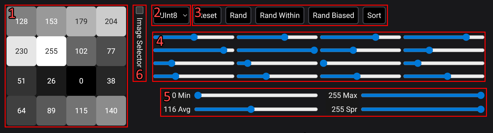

[BC4](https://learn.microsoft.com/en-us/windows/win32/direct3d10/d3d10-graphics-programming-guide-resources-block-compression#bc4) is a single-channel compressed image format. It divides the image into 4×4 pixel blocks and compresses each block independently. Block compression works by selecting two 8-bit endpoints and interpolating between them to create a palette of 8 values. Finally, each pixel in a block is represented by the closest value in the palette.

Since there is one palette value that best represents a pixel (or multiple that are equally good), palette indexes are uniquely determined by the endpoints. So the task of an encoder is to pick two endpoints that minimize the overall error for a block. This results in a 256×256=65,536 possible encodings (2^8 bits for each endpoint) per block. The (relatively) small search space makes it possible to visualize the compression error for all possible endpoint pairs.

See below for an explanation of the visualization.

## Visualization

<div class="info" data-title="Limitations">

The visualization is primarily designed around mouse input. It may not work well on touch devices.

</div>

```json:custom
{
    "component": "bc4-error-vis"
}
```

## Usage

The visualization consists of two main parts: the block input and the error map. Use the block input to set the pixel values of the block you want to analyze (or one similar to it). The error map will then show the compression error for all possible endpoint pairs.

### Block Input



1. 4×4 pixel grid: This shows the current pixel values of the block.
2. The mode selector:

    The mode selector changes between two modes. In Uint8 mode, the pixel values are unsigned 8-bit integers (0-255). In Float mode, the pixel values are normalized floats (0.0 - 1.0). Both modes behave very similarly, except for block with small spread (<16) where the aliasing artifacts are more pronounced in Uint8 mode.

3. A few useful buttons:

    - _Reset:_ Resets the block to its default state.
    - _Rand:_ Sets the block to uniformly random pixel values.
    - _Rand Within:_ Sets the block to uniformly random pixel values within the min and max of the current block. This is useful to get a random block with a specific spread.
    - _Rand Biased:_ Same as _Rand Within_, but the random values are heavily biased towards the min values.
    - _Sort:_ Sorts the pixel values in ascending order. Compression only depends on pixel values not order, so this does not change the error map. All Rand\* buttons will keep pixels sorted if the block is currently sorted.

4. 4×4 slider grid: This allows you to set the value of each pixel.
5. Sliders for the min/max/avg/spread of the pixel values in the block. (Spread is max - min.)

    The four sliders for min/max/avg/spread allow you to quickly adjust the pixel values in the block.

6. Image Selector: If checked, the layout of the block input will change to add an image from which you can select 4×4 pixel blocks from.

    - Click on the image to select a block. The selected block is highlighted with a red square.
    - On the side, there is a list of images to choose from. Click on a button to change the image.

### Error Map

The visualization is two 256×256 grids of all possible endpoint pairs (x, y) = (E0, E1).

The first grid is the _error map_. It shows the compression error (PSNR) for each endpoint pair. Dark/red colors indicate high error (low PSNR), while bright/blue colors indicate low error (high PSNR). The lowest error (highest PSNR) has the color cyan. Use your mouse to hover over the grid and see the exact PSNR value for each endpoint pair. Some endpoints are marked with special colors:

-   Red: The best endpoint pair (highest PSNR).
-   Black: The trivial endpoint pair that uses the min-max of the block. (P6 mode ignores pure black and pure white pixels when calculating the min/max.)
-   White: Nudged trivial endpoint pair. This is the same as the trivial endpoint pair, but nudged by 5% toward the average (mean) pixel value. This is often a better choice since it reduces the impact of outliers.

The second grid is the derivatives map. This makes the change in error more visible. (Since derivatives take longer to compute, this map will not update in real-time. Simply stop moving the mouse briefly to see the current derivatives.)
