I had a problem some time ago: I wanted to apply a threshold to an image to get a black-and-white version. This is easy enough in most image-editing programs and image libraries (like OpenCV). For example, here's a threshold applied to a masterful artwork:

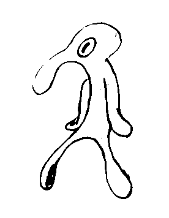

However, all pixels in the thresholded image are _only_ pure black or pure white:

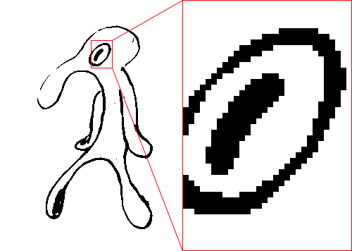

The once smooth lines of the original have been replaced by a series of black-and-white steps. Of course, that's to be expected. It's what regular thresholding does. Pure black and white with no in-betweens. Sometimes that's desirable, sometimes not.

In my case, I wanted to keep the smooth lines and sub-pixel details of the original in the thresholded image. In other words, I needed anti-aliasing.

## Contents

## Just scale it up

Since aliasing is ([somewhat definitionally](https://en.wikipedia.org/wiki/Aliasing)) caused by insufficient samples, the simplest way to reduce aliasing is to increase the number of samples.

One extremely simple way of doing this is to resize the image to a larger size, apply the threshold, and then resize it back down to its original size. Like so:

1. Scale up the image by 800% (with linear interpolation).
2. Threshold the scaled up image.
3. Scale down the thresholded image to the original size (with area/box filtering or binning).

This will average 8×8=64 samples per pixel and result in a smoothly thresholded image:

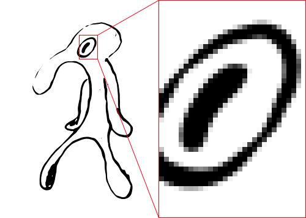

Note that smooth lines aren't all we get. Lines have cleaner edges, which makes it possible to judge the thickness of lines on a sub-pixel level.

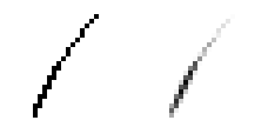

Nice!

### Why does this work?

Scaling up the image before thresholding it gives multiple thresholding samples per pixel. A kind of [supersampling anti-aliasing](https://en.wikipedia.org/wiki/Supersampling) (SSAA) in a sense.

To talk a bit more about the details: The problem with regular thresholding is that rasterized images only have a finite resolution. A pixel (typically) represents the _average_ signal strength of the area it covers (usually light intensity). Applying a threshold to this average will give a different result than applying the same threshold to the original signal and then averaging.

**Example:** Imagine an image of a tree where one particular leaf is represented by a single pixel. Whether the light intensity signal of that leaf is first averaged and then thresholded, or the other way around, matters and will change the final color.


It matters a lot.

So for thresholding with anti-aliasing, we ideally want to apply the threshold to the original signal, not the rasterized image.

Unfortunately, this is impossible. The original signal (generally) cannot be reconstructed from a rasterized image. To get around this, we (crudely) approximate the original signal by scaling up the rasterized image. Far from perfect, but this is as closest as we can get to the original signal (in reasonable time).

I used linear interpolation because it's simple, fast, and gives similar results to more sophisticated filters such as Lanczos. Other methods, such as upscaling based on neural networks, can give better results but are significantly more expensive to compute. Linear interpolation also has certain nice properties that come in handy later

## Performance

While linear interpolation is quite fast, it is very _very_ slow compared to regular thresholding. Scaling up an image by 8x results 64x more pixels to process and keep in memory. Of course, it's not "just" 64x slower since up and down scaling are not free.

### Benchmark

To give some concrete numbers, I implemented regular thresholding and thresholding using the resizing method as described above in Rust. I use the [`image`](https://crates.io/crates/image) crate for loading/saving images and the [`resize`](https://crates.io/crates/resize) crate for resizing. Regular thresholding is trivial to implement, so I did that myself. The code is [available on GitHub](https://github.com/RunDevelopment/threshold-aa).

The benchmark measures all operations using an in-memory image. The original image will not be altered, and the output image will be written into a pre-allocated buffer of the same size. The test image is 8-bit grayscale with 1000×1000 pixels. This image to be exact:


<div class="info">

I used the above image, because it has lots of details, clearly visible dark and bright areas, and a mix of low-frequency and high-frequency features.

The [original image](https://pxhere.com/en/photo/1118987) is CC0 by an unknown author. I converted it to grayscale and resized it to 1000×1000 pixels.

</div>

Criterion is used for benchmarking, so I will report [criterion's best estimate](https://bheisler.github.io/criterion.rs/book/user_guide/command_line_output.html#time).

Here are the results:

| Method        | Time      | Relative |
| ------------- | --------- | -------- |
| `no_aa`       | 34.861 µs | 1x       |
| `resize 800%` | 44.613 ms | 1280x    |

Look at those units. Thresholding with 800% upscaling is over 1000x slower than regular thresholding. This is somewhat expected since regular thresholding is extremely SIMD-friendly, cache-friendly, and only does one pass over the image. So not only is the resizing method for anti-aliasing slow, regular thresholding is also very fast, causing the huge performance difference we see.

While there is no chance of getting close to the performance of regular thresholding, we can do better than 1000x slower.

## Interpolation without resizing

The first improvement will be to avoid scaling up the image. Instead of creating a huge intermediate image, samples can be (bi-)linearly interpolated on the fly. This would be trivial to do on a GPU thanks to native hardware support, but we have to do it ourselves on the CPU.


Luckily, [bilinear interpolation](https://en.wikipedia.org/wiki/Bilinear_interpolation) is simple. To calculate the interpolated value at any coordinate, take a weighted average of the 4 nearest pixels. Weights are determined by the distance of the coordinate to the nearest pixels.

To define bilinear interpolation: Given 4 corner (or pixel) values $v(0,0), v(1,0), v(0,1), v(1,1)$, the interpolated value $v(x,y)$ at coordinate $(x,y)\in[0,1]^2$ is:

$$
\def\lerp{\operatorname{lerp}}

\begin{split}
v(x,y)
=& \space v(0,0)(1-x)(1-y)+v(1,0)x(1-y)+ v(0,1)(1-x)y+v(1,1)xy \\
=& \space v(0,0)+x\big( v(1,0)-v(0,0)\big)+y\big(v(0,1)-v(0,0)\big) \\ &+ xy\big(v(0,0)-v(1,0)-v(0,1)+v(1,1)\big) \\
=& \space \lerp(\lerp(v(0,0), v(1,0), x), \space \lerp(v(0,1), v(1,1), x),\space y) \\
=& \space \lerp(\lerp(v(0,0), v(0,1), y), \space \lerp(v(1,0), v(1,1), y),\space x) \\
\end{split}
$$

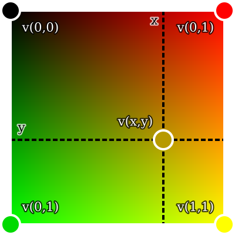

From here on, I will call the construct of the 4 corner values plus bilinear interpolation between them a _bilinear interpolation kernel_ (or just _bilinear kernel_ or _kernel_).

With bilinear kernels, we can take as many samples for thresholding as we want without having to resize. In fact, the problem of thresholding the image reduces to thresholding bilinear kernels that correspond to pixels.

Unfortunately, there's a slight issue. When interpolating an image, we generally imagine the value of a pixel to be at the **center** of the pixel cell. This means that the corners of bilinear kernels will be at the center of pixel cells.

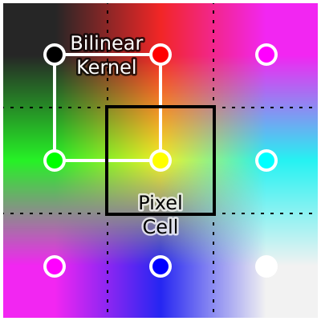

Consequently, one bilinear kernel is not sufficient. We need to consider the 4 bilinear kernels in the 3×3 neighborhood around the pixel. And of these 4 kernels, only the parts that intersect the pixel cell are relevant. Each intersection is exactly one quadrant of a kernel, so the full pixel cell is covered by 4 quadrants (Q1-Q4) from the 4 kernels.

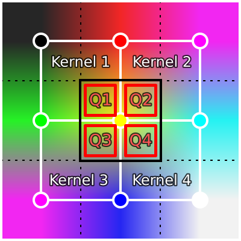

One nice property of bilinear interpolation is that the 4 quadrants are themselves bilinear kernels. The corner values of a quadrant kernel are simply the values sampled from the full kernel at the corner positions.

<div class="info">

In general, any rectangle inside a bilinear kernel is itself a bilinear kernel.

</div>

Sampling is rather simple. I use a regular N×N sample grid per quadrant for a total of N×N×4 samples per pixel. Simply count the samples above the threshold and divide by the number of sample to get the percentage of samples above the threshold.

For now, I will use 4×4 samples per quadrant (64 samples per pixel) since it's the same number of samples as upscaling by 800%. Consequently, the resize method and this new interpolation method produce equivalent results (ignoring minor rounding differences). However, the interpolation method is faster and uses no additional memory.

| Method         | Time      | Relative | Additional memory  |
| -------------- | --------- | -------- | ------------------ |
| `no_aa`        | 34.861 µs | 1x       | 0                  |
| `resize 800%`  | 44.613 ms | 1280x    | 64 bytes per pixel |
| `interp 4x4x4` | 24.217 ms | 695x     | 0                  |

Around 2x faster, but there is more low-hanging fruit.

### Skipping pixels

Next, I'll use another property of bilinear interpolation: interpolated values are always between the minimum and maximum of the 4 corner values (if $(x,y) \in [0,1]^2$). So if the 4 corner values are all above or all below the threshold, then interpolated values will also be all above or all below the threshold.

At the pixel level, this means that if all pixels in the 3×3 neighborhood of the current pixel are either all above or all below the threshold, then all interpolated value in the quadrants of that pixel must also be all above or all below the threshold. In other words, we only need anti-aliasing for pixels **near edges** in the no AA thresholded image.

This makes it possible to implement thresholding with anti-aliasing as a post-processing step to regular thresholding like so:

1. Threshold the image _without_ anti-aliasing (very fast).
2. Detect all pixels that have both black and white pixels in their 3×3 neighborhood (=all pixel near an edge).
3. Use thresholding with anti-aliasing only for pixels near detected edges.

To detect edges, I convert the thresholded image into a bitmap with 1 bit per pixel. Each row is stored as a list of `u32`s, each `u32` representing 32 pixels. This representation makes it possible to detect edges for 32 pixels at once with just a few bitwise operations. Detected edges are stored in a separate bitmap, which is also 1 bit per pixel.

The edges of the benchmark image look like this:

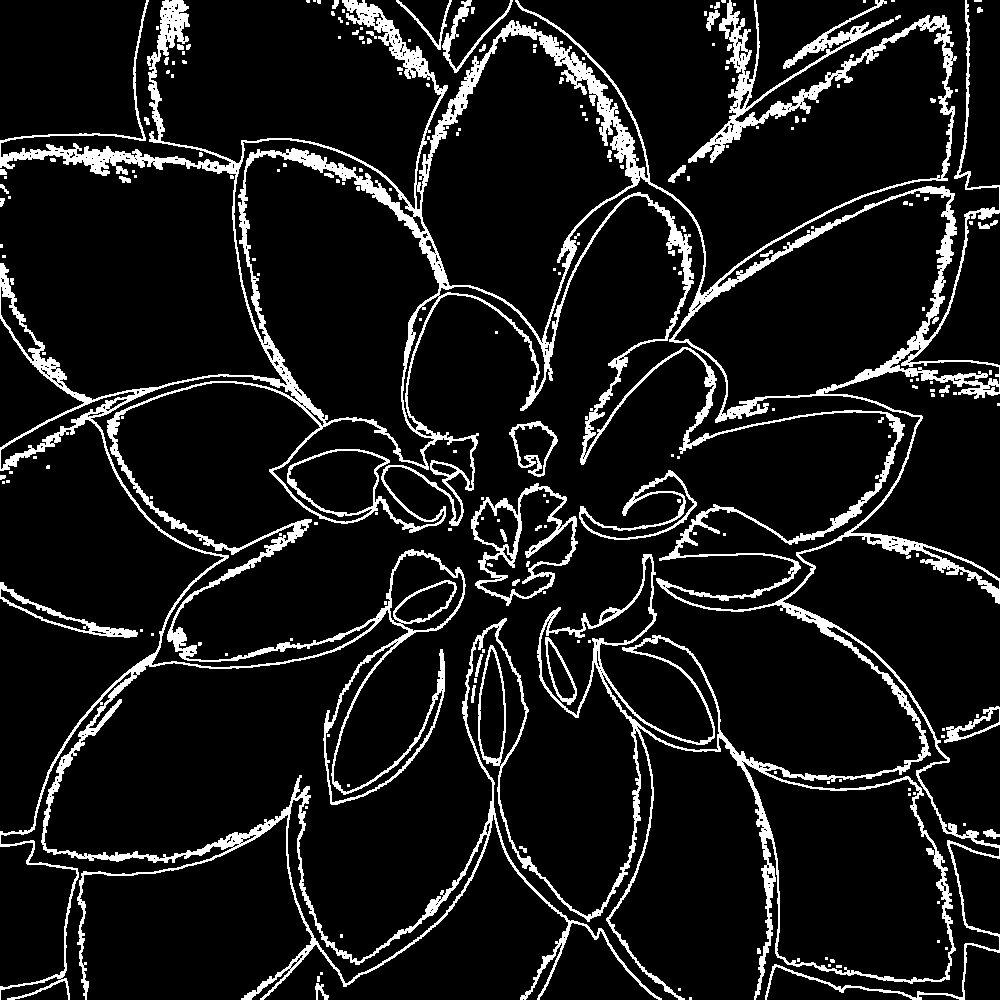

Around 90% of pixels in the benchmark image can be skipped. So, how does it perform?

| Method               | Time      | Relative | Additional memory  |
| -------------------- | --------- | -------- | ------------------ |
| `no_aa`              | 34.861 µs | 1x       | 0                  |
| `resize 800%`        | 44.613 ms | 1280x    | 64 bytes per pixel |
| `interp 4x4x4`       | 24.217 ms | 695x     | 0                  |
| `interp edges 4x4x4` | 3.3576 ms | 96x      | 2 bits per pixel   |

Now it's "just" 100x slower. A huge improvement.

Unfortunately, edge detection itself is now unavoidable overhead and costs around 500 µs for the benchmark image. This is good, because it means that most time (around 80%) is spent on actual work (anti-aliasing). But it's also bad, because it means that we cannot go faster than 500 µs (for the benchmark image) no matter how fast anti-aliasing becomes. So any anti-aliasing using this approach will be at least ~15x slower than no anti-aliasing.

Since this speed up is based on skipping unnecessary pixels, the runtime of the algorithm now depends on the number of edge pixel in the image. The more edge pixel, the slower it is. There are also certain types of images where (almost) all pixel are edge pixel (e.g. high-frequency noise and checkerboard patterns). For such images, edge detection is pure overhead.

### Number of samples

We can use more or fewer samples per pixel to trade quality for performance.

| Samples per pixel | Time      |
| ----------------- | --------- |
| 4 (1×1×4)         | 2.2772 ms |
| 16 (2×2×4)        | 2.8479 ms |
| 64 (4×4×4)        | 3.3576 ms |
| 256 (8×8×4)       | 12.889 ms |
| 1024 (16×16×4)    | 43.836 ms |

(4 samples per pixel is the minimum, because that's 1 sample per quadrant. Also, 256 spp is not tested for quality below, because its quality is close to 64 spp while being 3x slower.)

To judge the quality, here are some sample images with 1 spp (no AA), 4 spp, 16 spp, 64 spp, and 1024 spp. (Note that 1024 spp is almost ground truth.)

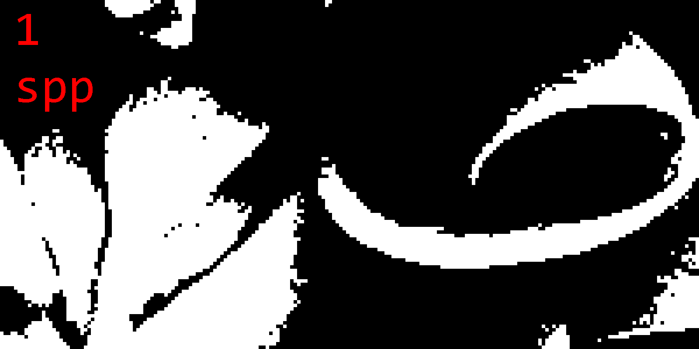

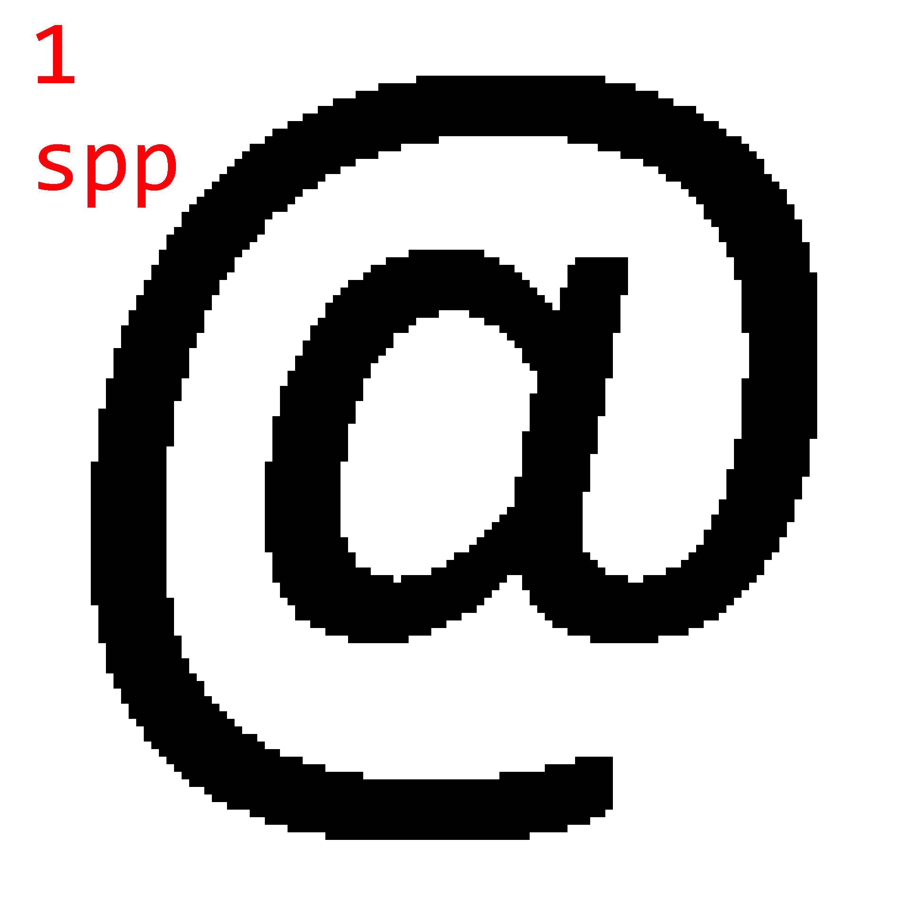

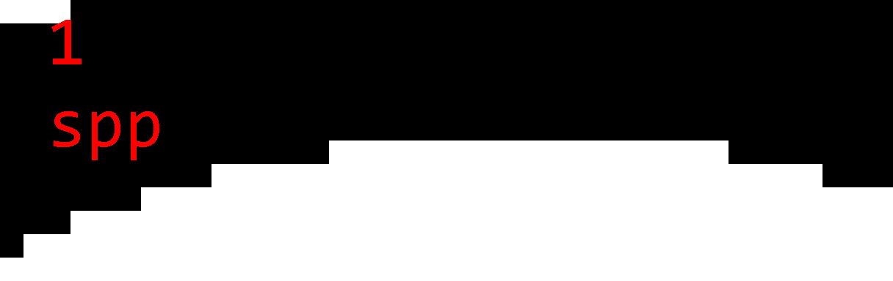

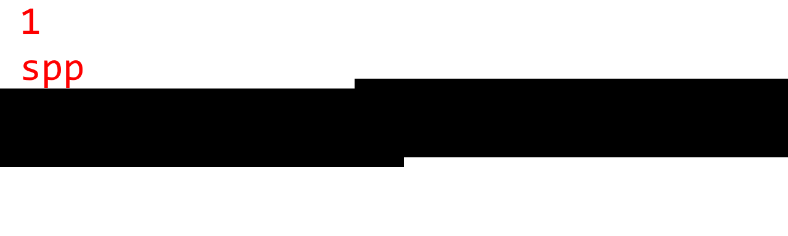

Observations:

1. There are noticeable step artifacts with 4 spp. This is because 4 samples can only produce 5 gray levels.
2. The difference between 16 spp and 64 spp is small, but noticeable in certain cases.
3. 64 spp and 1024 spp are almost indistinguishable is most cases.
4. There are certain worst-cases (the line image), where even 64 spp produce noticeable step artifacts.

I'd say that the sweet spot is 64 spp. It gives good quality in most cases while not being much slower than 16 spp.

### Improving quality

64 samples per pixel might sound like a lot, but that's not always the case. Since samples are arranged in a regular grid, there are certain worst-case scenarios where we only get quality equivalent to 8 samples. E.g. if the gradient is (roughly) aligned with the x or y axis, the thresholded kernel will also be (roughly) aligned with the x or y axis, which causes all samples in one direction to have the same threshold values. This can cause noticeable step artifacts.

To illustrate this phenomenon, here is a render of the bilinear kernel of a single quadrant plus its sample positions:

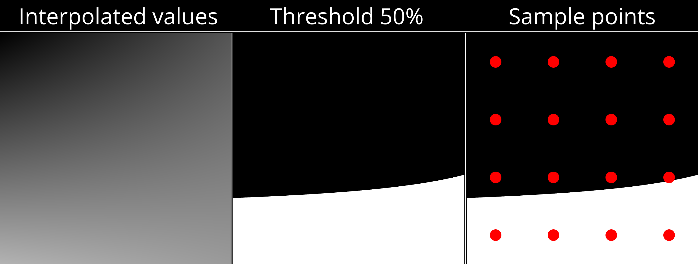

Only 4 out of 16 samples are above the threshold of 50%, despite over 5/16th of the kernel being above the threshold.

Better sampling strategies can help. Rotated grid, randomized sampling, and stratified sampling all improve worst case quality, but come with non-trivial performance costs. So instead of pursuing better point sampling strategies, I want to focus on a different approach.

## Line sampling

It bears repeating that bilinear interpolation is simple. By defining some constants, the expression for $v(x,y)$ can be written as:

$$
\begin{split}
a &:= v(0,0)-v(1,0)-v(0,1)+v(1,1) \\
b &:= v(1,0) - v(0,0) \\
c &:= v(0,1) - v(0,0) \\
d &:= v(0,0) \\
v(x,y) &= axy+bx+cy+d \\
\end{split}
$$

If we then hold one input coordinate constant (either x or y), we get a simple linear function of the other coordinate.

$$
\begin{split}
v_x(y) &= (ax+c)y+(bx+d) \\
v_y(x) &= (ay+b)x+(cy+d) \\
\end{split}
$$

So instead of sampling a certain number of points along such a line, we can simply calculate the exact point where the line crosses the threshold (if at all). This will yield the exact percentage of how much of the line is above the threshold.

$$
\begin{split}
v_x(y) = t &\implies y = \frac{t-(bx+d)}{ax+c} \\
v_y(x) = t &\implies x = \frac{t-(cy+d)}{ay+b} \\
\end{split}
$$

<div class="info" data-title="Note">

Cases where $ax+c=0$ and $ay+b=0$ for $v_x(y)$ and $v_y(x)$ respectively have to be handled separately.

</div>

However, whether to use horizontal or vertical lines ($v_y(x)$ or $v_x(y)$ respectively) for a given kernel matters a lot.

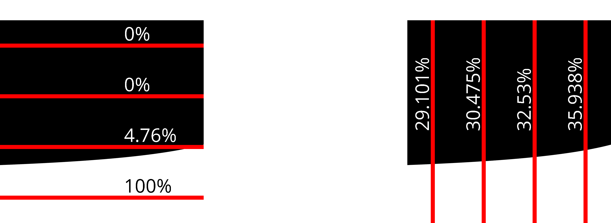

While both horizontal and vertical lines are better than point sampling, vertical lines give much better results than horizontal lines _for this specific kernel_.

<div class="info">

In practice, it's enough to implement line sampling along only one direction. A kernel can easily be rotated 90° to get the other direction. Just rotate the corner values.

</div>

### Heuristics

Since there seems to be no obvious way of knowing beforehand which direction is optimal, I devised 3 heuristics to decide between sampling with horizontal or vertical lines. All of them are based on the idea of measuring the magnitude of the slope (absolute derivative) in the x and y directions and comparing them. To see why this can work, consider the following two kernels:

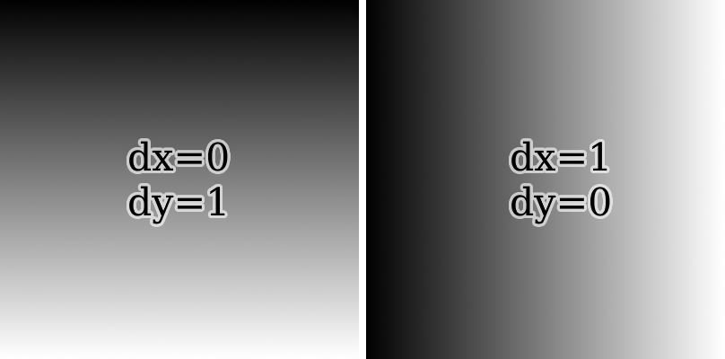

If the magnitude of the slope in the x direction is lesser, it's best to sample along the y direction with vertical lines. Otherwise, sample using horizontal lines.

<div class="info" data-title="Quick note on notation">

Partial derivatives of $v$ will be denoted as:

$$
\begin{split}
d_x(y) &:= \partial_x v(x,y) = ay+b \\
d_y(x) &:= \partial_y v(x,y) = ax+c \\
\end{split}
$$

This is just a terser notation, since $\partial_x v$ and $\partial_y v$ do not depend on $x$ and $y$ respectively.

Note that partial derivatives are efficiently and exactly calculated using a [finite difference](https://en.wikipedia.org/wiki/Finite_difference): $d_x(y) = v(1,y) - v(0,y)$ and $d_y(x) = v(x,1) - v(x,0)$.

</div>

Heuristics only differ by how they measure the magnitude of the slope.

1. **Center partial derivatives (CPD)**: Calculate the partial derivatives of the bilinear kernel at the center point. Compare $|d_x(0.5)|$ and $|d_y(0.5)|$.
2. **Absolute sum of differences (ASD)**: Calculate the partial derivatives for the lines x=0, x=1, y=0, and y=1. Compare $|d_x(0)+d_x(1)|$ and $|d_y(0)+d_y(1)|$.
3. **Sum of absolute differences (SAD)**: Calculate the partial derivatives for the lines x=0, x=1, y=0, and y=1. Compare $|d_x(0)|+|d_x(1)|$ and $|d_y(0)|+|d_y(1)|$.

To determine the effectiveness of these heuristics, I measured their PSNR against a reference area calculated from the average of 1024 horizontal lines and 1024 vertical lines. As test data, I used 3 data sources:

1. Synthetically generated bilinear kernels. These are the $11^4$ possible kernels for corner values $\set{i/10 | i=0,...,10}$.
2. The kernels of the edge pixels from the benchmark flower image. This represents natural image data.
3. The kernels of the edge pixels from the @-symbol image above. This represents noise-free data with a lot of curves and lines.

The below table shows the PSNR (in dB) of:

- all 3 heuristics,
- sampling with _fixed_ horizontal (H) and _fixed_ vertical lines (V), and
- sampling with optimal direction. (This means sampling both horizontally and vertically and then picking whichever is better to get the optimal result for a given number of lines. No heuristic can be better than this.)

| # lines | Data   | CPD PSNR | ASD PSNR | SAD PSNR | H PSNR | V PSNR | Optimal PSNR |
| ------- | ------ | -------- | -------- | -------- | ------ | ------ | ------------ |
| 1       | syn    | 23.52    | 23.52    | 20.45    | 16.64  | 16.64  | 23.61        |
| 2       | syn    | 32.93    | 32.93    | 31.98    | 28.09  | 28.09  | 35.92        |
| 4       | syn    | 42.22    | 42.22    | 39.78    | 36.18  | 36.18  | 44.71        |
| 8       | syn    | 53.34    | 53.34    | 48.04    | 45.21  | 45.22  | 54.76        |
|         |        |          |          |          |        |        |              |
| 1       | flower | 30.20    | 30.20    | 29.95    | 18.58  | 18.68  | 30.27        |
| 2       | flower | 41.35    | 41.35    | 41.04    | 27.13  | 27.22  | 42.73        |
| 4       | flower | 52.46    | 52.46    | 51.85    | 35.87  | 36.05  | 54.42        |
| 8       | flower | 62.77    | 62.77    | 62.05    | 44.77  | 45.11  | 64.79        |
|         |        |          |          |          |        |        |              |
| 1       | at     | 31.80    | 31.80    | 31.80    | 18.34  | 17.30  | 31.80        |
| 2       | at     | 44.78    | 44.78    | 44.78    | 28.23  | 26.84  | 46.02        |
| 4       | at     | 54.67    | 54.67    | 54.67    | 34.11  | 34.61  | 56.18        |
| 8       | at     | 69.52    | 69.52    | 69.52    | 37.46  | 39.18  | 70.90        |

([Data](https://github.com/RunDevelopment/threshold-aa/blob/main/quality.md) generated by my reference implementation.)

A few things stand out:

1. Fixed horizontal and vertical line sampling have roughly the same PSNR. This is expected for random kernels and still mostly holds for real images.
1. All heuristics perform significantly better than fixed horizontal/vertical line sampling. Especially for real images, the gain is greater +10 dB.
1. CPD and ASD are equivalent. This is because $|d_x(0)+d_x(1)| = 2|d_x(0.5)|$. So the comparisons between slope magnitudes always yields the same results. From here on out, I will ignore ASD since it's redundant.
1. For 1 line, CPD is the best heuristic and very close to optimal. It's only off by around 0.1 dB.
1. For 2+ lines, CPD is still good. It's typically slightly better than SAD and only 1-2 dB worse than optimal.

Since CPD is the best heuristic, I will use it for the rest of this article without further mention. Other heuristics will not be considered from now on.

### Quality comparison

With the heuristic in place, comparing the quality of line sampling to point sampling shows how much more capable line sampling is:

| per quadrant  | per pixel | syn   | flower | at    |
| ------------- | --------- | ----- | ------ | ----- |
| 1 line        | 4 lpp     | 23.52 | 30.20  | 31.80 |
| 2 lines       | 8 lpp     | 32.93 | 41.35  | 44.78 |
| 4 lines       | 16 lpp    | 42.22 | 52.46  | 54.67 |
| 8 lines       | 32 lpp    | 53.34 | 62.77  | 69.52 |
|               |           |       |        |       |
| 1×1 samples   | 4 spp     | 11.37 | 12.24  | 12.25 |
| 2×2 samples   | 16 spp    | 21.59 | 21.27  | 21.71 |
| 4×4 samples   | 64 spp    | 30.02 | 30.31  | 29.61 |
| 8×8 samples   | 256 spp   | 38.82 | 39.35  | 34.66 |
| 16×16 samples | 1024 spp  | 47.63 | 48.30  | 45.99 |

Just 1 line gives quality similar to 4×4 samples. But that's not all. PSNR only describes _how much_ error there is, not how the error is _distributed_. So here are images of the absolute error in the flower and @-symbol images (amplified 32× for visibility) comparing 4×4 samples (64 spp) to 1 line (4 lpp):

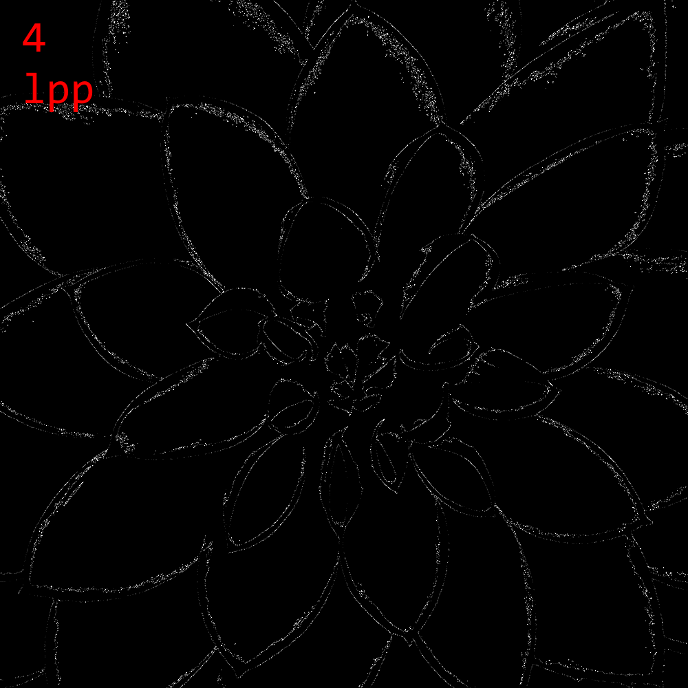

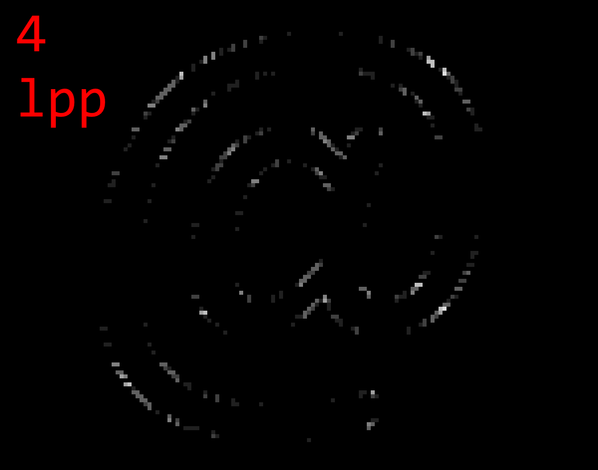

The errors are qualitatively different.

- Point sampling error is evenly distributed throughout the image.
- Line sampling error is almost zero at edges/gradients that are roughly aligned horizontally or vertically. Error is greater in visually complex areas and edges/gradient that are roughly aligned diagonally.

The difference is most noticeable for edges/gradients that are roughly horizontal or vertical. While point sampling produces obvious step artifacts, line sampling produces smooth transitions.

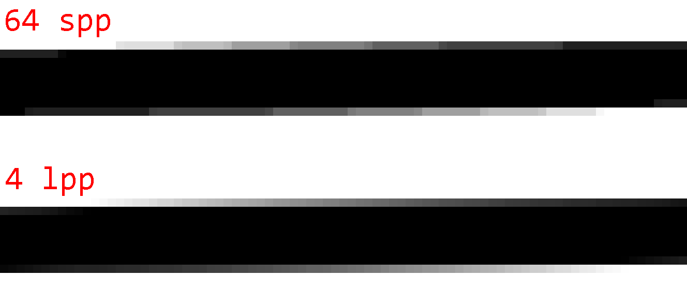

As such, the error of line sampling is preferable to the error of point sampling. Line sampling error is harder to notice and consequently produces visually higher-quality images even if the PSNR is similar to point sampling.

#### Interactive comparison

This visualization shows a single bilinear kernel, its exact area above the threshold, and its approximations by point and line sampling. You can adjust kernel values and the threshold to see how the approximations change. The buttons on the right loads different preset kernels and generate random kernels.

Hover over the result of an approximation to see its sample points/lines visualized. Click a result to keep the sample visualization on screen.

```json:custom
{
    "component": "kernel-visualization",
    "props": {
        "showApproximations": true,
        "applyThreshold": true
    }
}
```

<div class="info" data-title="Tip">

Try a bunch of random kernels to get a feel for how approximations compare to each other.

</div>

### Performance comparison

Performance-wise, line sampling with 4 lines per pixel (1 line per quadrant) is comparable to point sampling with 64 samples per pixel.

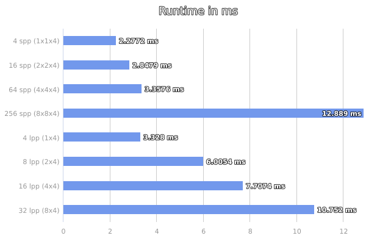

Here's another plot showing runtime vs PSNR. (Note that the time axis is logarithmic.)


<details>
<summary>Same data in table form</summary>

| Samples            | Time      | PSNR      |
| ------------------ | --------- | --------- |
| 4 spp (1×1×4)      | 2.2772 ms | 12.24 dB  |
| 16 spp (2×2×4)     | 2.8479 ms | 21.27 dB  |
| 64 spp (4×4×4)     | 3.3576 ms | 30.31 dB  |
| 256 spp (8×8×4)    | 12.889 ms | 39.35 dB  |
| 1024 spp (16×16×4) | 43.836 ms | 48.30 dB  |
|                    |           |           |
| 4 lpp (1×4)        | 3.3280 ms | 30.20 dB  |
| 8 lpp (2×4)        | 6.0054 ms | 41.35 dB  |
| 16 lpp (4×4)       | 7.7074 ms | 52.46 dB  |
| 32 lpp (8×4)       | 10.752 ms | 62.77 dB  |
|                    |           |           |
| Exact              | 9.2775 ms | 116.62 dB |

</details>

Also note that point sampling is generally inferior to line sampling starting at 256 spp. At 256 spp has quality comparable to 8 lpp, but is around 2x slower. At 1024 spp, point sampling is comparable to 16 lpp while being around 6x slower.

<div class="info">

Compared to point sampling (which perfectly auto-vectorizes), line sampling is more difficult to implement efficiently. It requires at least one branch for kernel rotation and two branches per line to handle edge cases. This makes it less SIMD-friendly and more difficult to optimize.

However, 1 line sample per kernel in particular can be heavily optimized. This is largely due to the fact that the CPD heuristic happens to calculate intermediate values that can be reused for line sampling. This lowers the cost of the heuristic.

</div>

## Exact threshold area

Before moving on to the next section, I want to finish the discussion around quality and performance by presenting an algorithm to calculate the threshold area of a bilinear kernel exactly. This probably doesn't have much practical use since it's not that fast, but it's nonetheless useful as a reference. It also sets an upper bound for the performance budget approximations like point sampling and line sampling have. Any approximation _slower_ than the exact algorithm is not useful.

To spoil the ending, the exact algorithm takes 9.2775 ms. Adding it to the scatter plot from above shows that point sampling ≥256 spp and line sampling ≥32 lpp are worse than the exact algorithm in both quality and performance.


Anyway. Time to take the plunge and solve an integral.

Let $v$ define a bilinear kernel and $t\in\R$ be a threshold. Then let $s(x,y):=v(x,y)-t$ be the sample function. This function has the property that $s(x,y)=0$ describes the edge between the area above and below the threshold. Using the definition of $v(x,y)$, we can write $s$ as:

$$
s(x,y) = axy + bx + cy + d
$$

for:

$$
\begin{split}
a &= v(1,1)-v(1,0)-v(0,1)+v(0,0) \\
b &= v(1,0)-v(0,0) = d_x(0) \\
c &= v(0,1)-v(0,0) = d_y(0) \\
d &= v(0,0)-t \\
\end{split}
$$

Note: These constants are similar to the ones defined before for $v$, but $d$ has an additional $-t$.

Solving $s(x,y) = axy + bx + cy + d=0$ for $y$ gives a new function in $x$, which describes the edge between the area above and below the threshold:

$$
f(x) = -(xb + d) / (xa + c)
$$

<div class="info" data-title="Edge case: $a=0$">

With $a=0$, $f(x)$ simplifies to a linear function, integration of which is easy. I will not cover this case. Suffices to say that both $c=0$ and $b=0$ are inconvenient but not difficult to handle.

</div>

Next, [integrating $dx$](https://www.wolframalpha.com/input?i=integrate+-%28xb+%2B+d%29+%2F+%28xa+%2B+c%29+dx) gives:

$$
F(x) = \frac{(bc - ad) \cdot \ln(ax + c) - abx}{a^2} + \text{constant}
$$

Define constants $p=b/a$ and $q=(bc - ad)/a^2$ to simply:

$$
F(x) = q \ln(ax + c) - px + \text{constant}
$$

Then the area $A$ under the curve $f$ from $x_0$ to $x_1$ is:

$$
\begin{split}
A(x_0,x_1) &= F(x_1) - F(x_0) \\
&= q (\ln(ax_1+c) - \ln(ax_0+c)) - p(x_1-x_0) \\
&= q \ln\frac{ax_1+c}{ax_0+c} - p(x_1-x_0)
\end{split}
$$

Note that $\ln$ in $F$ is [the (principal) complex-valued logarithm](https://en.wikipedia.org/wiki/Complex_logarithm). Since $A(x_0,x_1)$ is to be a real number, we require $(ax_1+c)/(ax_0+c)>0$. This is the case when $ax_0+c$ and $ax_1+c$ are non-zero and have the same sign, which is the case iff $\lnot(x_0 \le -c/a \le x_1)$.

The value $-c/a$ comes from the fact that $f$ has a pole at $x=-c/a$. This is easy to see by rewriting $f$ as:

$$
f(x) = \frac{q}{x+c/a}-p
$$

This form also reveals the true nature of $f$: it's the standard $1/x$ hyperbola, just translated and scaled.

### Splitting the hyperbola

Unfortunately, $A$ alone is not enough to calculate the threshold area of a kernel. The reason for which becomes obvious by looking at an example.

#### Example

This is an interactive visualization of a bilinear kernel. Feel free to change the parameters. You can reset to default, pick presets, and generate random kernels using the small buttons on the right. If the threshold is not applied, the red curve shows where interpolated values are equal to the threshold (this is $f$).

```json:custom
{
    "component": "kernel-visualization",
    "props": {
        "initial": {
            "v00": 1.0,
            "v10": 0.0,
            "v01": 0.0,
            "v11": 1.0,
            "t": 0.4
        },
        "showAbcd": true,
        "applyThreshold": false
    }
}
```

I hope you familiarized yourself with the many shapes of $f$ using the above visualization. Please reset the visualization now using the top right button.

To determine the area of the default kernel visualized above, simply split the kernel into 3 disjoint sections like so:

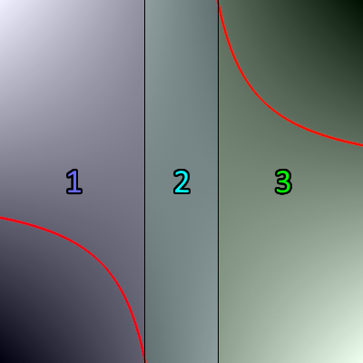

1. Section 1 covers the range $x \in [0,0.4]$. The area above the threshold is $A(0, 0.4)\approx 0.28047$.
2. Section 2 covers the range $x \in [0.4,0.6]$. Since this section contains the pole x=0.5, $A$ cannot be used. However, this section is fully above the threshold, so the area above the threshold is simply $0.2$.
3. Section 3 covers the range $x \in [0.6,1]$. The area above the threshold is $(1 - 0.6) - A(0.6, 1)\approx 0.28047$.

Together, the area of all three sections is around 0.76094 or 76.094%. Just like the interactive visualization says.

Note that the example is atypical in that section 1 and 3 have the same area. This is due to symmetry in the kernel, which is not the case in general.

<div class="info" data-title="Edge case: $q=0$">

For $q=0$, the edge between the area above and below the threshold is _not a function_. It's the union of two axis-aligned lines: $y=-b/a$ and $x=-c/a$. $f$ simplifies to $f(x) = -p = -b/a$, so it only captures the horizontal line.

Example:

```json:custom
{
    "component": "kernel-visualization",
    "props": {
        "initial": {
            "v00": 1.0,
            "v10": 0.75,
            "v01": 0.0,
            "v11": 1.0,
            "t": 0.8
        },
        "showAbcd": true,
        "applyThreshold": false
    }
}
```

This special case can either be handled separately, or by careful implementation of $A$. Only the $ln$ term inside $A$ is undefined (or imaginary) for such kernels, but since $q=0$ "removes" the $ln$ term, $A$ can still be implemented in a way that it works for $q=0$ kernels without any special handling.

</div>

#### Splitting strategy

In general, the kernel is split into sections at $x\in\set{0, 1, i_0, i_1}$ where $f(i_0) = 0$ and $f(i_1) = 1$.

$$
\begin{split}
i_0 &= \frac q p - \frac c a = -\frac d b \\
i_1 &= \frac q {p + 1} - \frac c a = -\frac {c+d} {a+b}

\end{split}
$$

Since only sections that overlap with the interval $x\in[0,1]$ are relevant, the kernel is split into between 1 and 3 sections.

Note that $i_0$ and $i_1$ are undefined if $p=0$ and $p=-1$ respectively. This corresponds to where the horizontal pole (i.e. where $1/x$ approaches the x axis) is at $y=0$ and $y=1$ respectively. In such cases, simply ignore the undefined intersection point.

### Section area

Given the section intervals $S_j$ created by splitting the interval $[0,1]$ according the strategy above, the area above the threshold for the kernel is the sum of the areas above the threshold for each section.

The area above the threshold of a section $S_j = [x_0, x_1]$ where $0 \le x_0 < x_1 \le 1$ is calculated as follows:

- Case 1: The section is fully above or fully below the threshold.

    This is the case if either
    - $x_0 < -c/a < x_1$ (the sections the (vertical) pole),
    - $s(x_m,0) \le 0 \land s(x_m,0) \le 0$, or
    - $s(x_m,0) \ge 0 \land s(x_m,0) \ge 0$.

    where $x_m = (x_0+x_1)/2$ is the middle of the section.

    The area above the threshold is $x_1-x_0$ if $s(x_m,0.5) > 0$ and $0$ otherwise.

- Case 2: The section is partially above the threshold. I.e. $f$ partitions $S_j$ into two non-empty sets of points above and below the threshold.

    The partition that includes $(x_m,0)$ has the area $a_0=A(x_0,x_1)$, and the partition that includes $(x_m,1)$ has the area $a_1=(x_1-x_0) - a_0$. $x_m$ is defined as before.

    The area above the threshold is $a_0$ if $s(x_m,0) > 0$ and $a_1$ otherwise.

### Logarithm and floating-point imprecision

When implementing

$$
A(x_0,x_1) = q \ln\frac{ax_1+c}{ax_0+c} - p(x_1-x_0)
$$

calculating $\ln\frac{ax_1+c}{ax_0+c}$ directly using a function like [`f32::ln`](https://doc.rust-lang.org/std/primitive.f32.html#method.ln) is not a good idea.

Let $r=(ax_1+c)/(ax_0+c)$ be the above ratio. If $a$ is close to 0, $r$ will naturally be close to 1. Unfortunately, floating-point numbers do poorly at representing numbers of the form 1.0000xxx (and 0.9999xxx). Applying the logarithm to such numbers will only amplify the error. And since $a$ close to 0 means that the magnitude of $q$ is large (because $q = (bc-ad)/a^2$), any error in the logarithm will be amplified further, causing very inaccurate results.

For example, suppose $r$ is 1.00000123456789. The closest float32 value to $r$ is 1.0000012. The logarithm of these numbers is 1.234567e-6 and 1.192092e-6 respectively. A relative error of 3.44%, which is then amplified by $q$.

In practice, I have observed errors of >3% for values of $a$ as large as 0.001 (well above common epsilon values) where $v(x,y)\in[0,1]$.

The solution is to use functions that calculate $\ln(1+x)$ for inputs $x$. E.g. [`f32::ln_1p`](https://doc.rust-lang.org/std/primitive.f32.html#method.ln_1p) in Rust and [`log1pf`](https://cppreference.com/c/numeric/math/log1p) in C. These functions offer much better precision for $x$ values close to 0.

Define:

$$
s=r-1=\frac{ax_1+c}{ax_0+c}-1=\frac{x_1-x_0}{x_0+c/a}
$$

Then $\ln(r) = \ln(1+s)$. Using $\ln(1+s)$, the logarithm can be calculated more accurately:

| Exact value        | `float32`       |       Logarithm from `float32` | Relative error |
| ------------------ | --------------- | -----------------------------: | -------------- |
| r=1.00000123456789 | 1.0000012       |    `f32::ln(r)` = 1.1920922e-6 | 3.44%          |
| s=0.00000123456789 | 0.0000012345679 | `f32::ln_1p(s)` = 1.2345671e-6 | 0.00000276%    |

[Playground](https://play.rust-lang.org/?version=stable&mode=debug&edition=2024&gist=3bcf48615871f75185510fe898644c22).

## Smoother anti-aliasing

Lastly, I want to share a trick for smoother anti-aliasing. And by "smooth" I mean blurry.

Sometimes it is desirable to have a tiny blur around in thresholded images. The edge from pure black to pure white can be quite harsh even with anti-aliasing, and a tiny blur can make it look much nicer.

We can get a perfect sub-pixel box blur for free by dividing kernels into 4 quadrants a little differently. To reiterate, this is how kernels are normally divided into 4 quadrants:


As we can see, each quadrant $Q_i$ covers exactly one quarter of the pixel, sourced from the corresponding bilinear kernel interpolating pixel values. However, we can also create quadrants covering more or less area of their source kernel by extending or contracting them away from the pixel center.

Let $s\in[0,1]$ be the _smoothing factor_. We can create quadrants that cover an area of $s^2$ pixels like so:


The smoothing factor $s$ has the following effect on the thresholded image:

- $s=0$: This produces the same results as no anti-aliasing.
- $0<s<0.5$: There is some smoothing, but aliasing artifacts are still visible.
- $s=0.5$: Normal smoothing.
- $0.5<s\le 1$: A small sub-pixel box blur is applied to the thresholded image. The box blur has a radius of approximately $s-0.5$ pixels.

Try it yourself!

```json:custom
{
    "component": "threshold-demo",
    "props": {}
}
```

Generally, only smoothing factors from 0.5 to 1 make sense. Any $s<0.5$ still shows aliasing artifacts.

## Future work

The implementations could be optimized more. I relied entirely on the compiler's ability to auto-vectorize to produce fast assembly in the benchmark. This should work well for point sampling, but the branches in line sampling most likely interfered with vectorization. Especially for the case of 1 line per quadrant (4spp), I see potential for more performance. Four lines per pixel map cleanly to commonly available SIMD registers (f32x4), so calculating 4 lines in parallel should provide a nice performance boost. This requires a branchless formulation of the line sampling algorithm, but that's not too hard to do.

The exact area calculation is also rather unoptimized. It has a lot of branching to handle edge cases, which could probably be expressed in a simpler and more performant manner. Investigating fast approximations of `ln_1p` might also be worth it.

## Conclusion

Even if a little niche, thresholding with anti-aliasing has its use cases.

While I didn't focus on it, the ideas and strategies in this article can also be used on the GPU. They just require a few minor adjustments.

Anyway, that's it from me. Goodbye!
