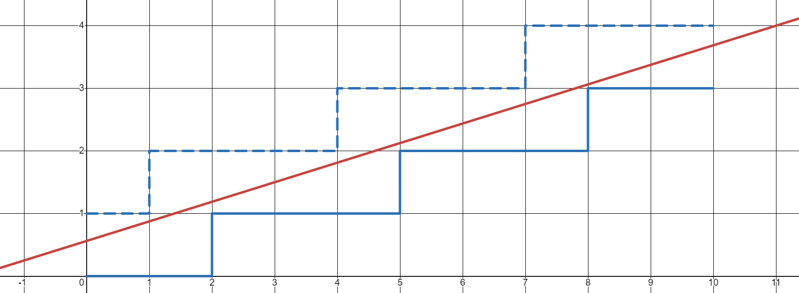
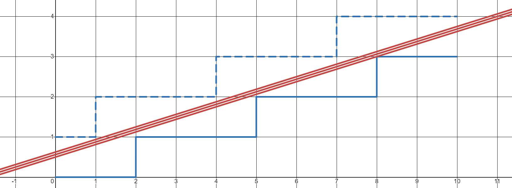
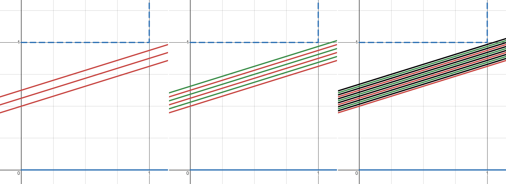
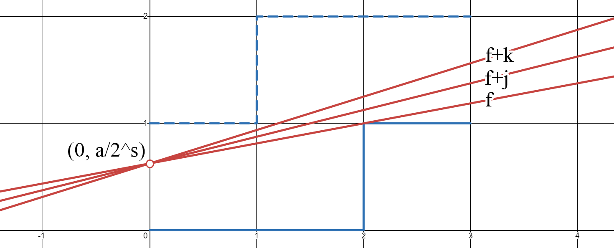
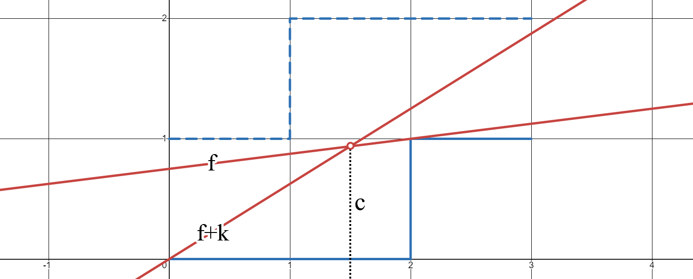
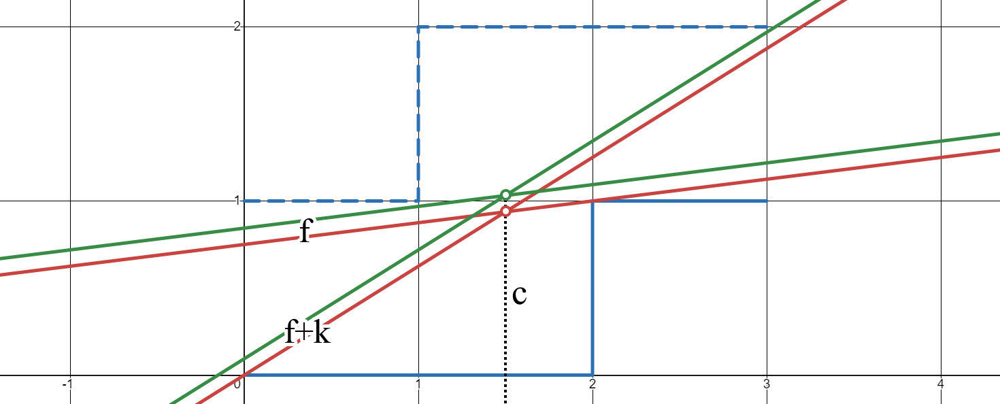
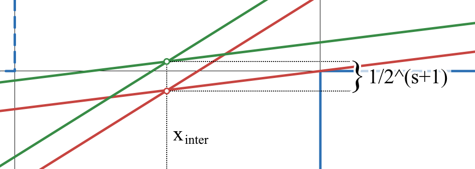
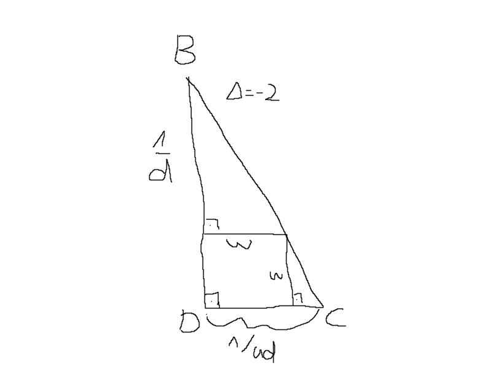

# Unsigned integer multiplication with a constant fraction

Integer division by a constant has long been the subject of optimization by all major compilers, as division is a rather slow operation on modern CPUs. To avoid this cost, compilers employ strategies to replace division with cheaper operations. One such strategy is the multiply-add method. It works as follows:

**Multiply-add method** (MAM): Given an expression of the form $\lfloor x/d \rfloor$, where $x\in\N$ is an integer and $d\in\N_1$ is a constant, it can be represented by constants $f,a,s\in\N$ such that:

$$
\lfloor \frac{x}{d} \rfloor = \lfloor \frac{xf + a}{2^s} \rfloor
$$

The MAM for constant division has been well-studied in the literature. It is also known that it can represent other rounding modes, such as `round` and `ceil`, by choosing different values $f,a,s$.

TODO: refs

However, I am not aware of any previous work using the MAM to represent the multiplication with a constant fraction. I.e. $R(x t / d)$ where $x\in\N$ is an integer, $t\in\N,d\in\N_1$ are constants forming a fraction, and $R: ℚ^+ \to \N$ is a rounding function.

In this article, I will analyse the problem and present an algorithm to find minimal constants $f,a,s$ in $O(s)$ time. Strategies to find constants more computationally efficiently than the minimal constants will also be discussed.

## Contents

## Motivation

TODO: Write

Main points:

-   Performance, performance, performance
-   Link to previous works/literature of constant division
-   Present this work as a unification of all previous MA works
-   Present this as the "final evolution" of the MAM, as all constants seems to be have been used to their fullest potential
-   Suggest future work to integrate this into compilers as a unified solution for all constant division and multiplication

## Definitions

<div class="info">

A quick note on notation:

-   $\N = \set{0,1,2,3,...}$
-   $\N_1 = \N \setminus \set{0} = \set{1,2,3,...}$
-   $\R^+ = [0,\infin)$
-   $ℚ^+ = \set{ q | q \in ℚ \land q\ge 0 }$

</div>

Let the constant fraction multiplication problem (CFMP) be defined as follows:

Given an input range $u\in\N_1$, a fraction $t/d$ with $t\in\N,d\in\N_1$, and a rounding constant $r_d\in\N,r_d<d$, find constants $f,a,s\in\N$ such that:

$$
\forall x\in\set{0,...,u}: \lfloor \frac{xt+r_d}{d} \rfloor = \lfloor \frac{xf + a}{2^s} \rfloor.
$$

The rounding constant $r_d$ depends on the rounding function and $d$. For the following rounding functions, it is chosen as follows:

-   `floor`: $r_d = 0$
-   `round`: $r_d = \lfloor d/2 \rfloor$
-   `ceil`: $r_d = d-1$

For terser notation, I will define:

-   $U := \set{0,...,u}$
-   $R(\alpha/d) := \lfloor (\alpha + r_d) / d \rfloor$

A triple $(f,a,s)\in\N^3$ is called a **solution** iff the above equation holds for all $x\in U$.

Using $z-1 < \lfloor z \rfloor \le z, \forall z\in\R$, the above equation can be rewritten to obtain an alternative equivalent definition for a solution: A triple $(f,a,s)\in\N^3$ is called a **solution** iff the following holds:

$$
\forall x\in U: R(xt/d) \le (xf + a)/{2^s} < R(xt/d) + 1
$$

This alternative definition is called the **inequality definition** of a solution. It is often easier to work with and will be used a lot.

A solution $(f,a,s)$ is called **minimal** iff no solution $(f',a',s-1)$ exists.

**Notes:**

1. There may be multiple minimal solutions for a given CFMP. However, most CFMPs have exactly one minimal solution.
2. Minimal solutions are important, because it is easy to iterate the entire solution space from a minimal solution, but it is hard to find a minimal solution to begin with. So most of the effort in solving a CFMP is spent on finding minimal solutions.

### Simplifications and trivial solutions

Some instances of the CFMP can be simplified and or trivially solved.

1. Most obviously, if $t$ and $d$ are not co-prime, then divide $t$ and $d$ by their GCD.

2. If $(u,t,d,r_d)$ is a CMFP with $t = jd+t'$ where $t'=t \bmod d$, then its solutions can be derived from the solutions of $(u,t',d,r_d)$.

    Let $(f,a,s)$ be a solution for $(u,t',d,r_d)$, then $(f + j 2^s,a,s)$ is a solution for $(u,t,d,r_d)$.

    <details>
    <summary><strong>Proof:</strong></summary>

    $$
    \begin{split}
    \lfloor \frac{xt+r_d}{d} \rfloor
    &= \lfloor \frac{xjd + xt' + r_d}{d} \rfloor \\
    &= \lfloor \frac{xt' + r_d}{d} \rfloor + jx \\
    &= \lfloor \frac{xf + a}{2^s} \rfloor + jx \\
    &= \lfloor \frac{xf + a + xj\cdot2^s}{2^s} \rfloor \\
    &= \lfloor \frac{x(f + j\cdot 2^s) + a}{2^s} \rfloor
    \end{split}
    $$

    </details>

3. If $(u,t,d,r_d)$ is a CMFP and $R(ut/d)=0$, then its solutions are the same as for $(u,0,1,0)$.

4. If $t=0$, then all $(f,a,s)\in\N^3$ such that $(uf+a)/2^s < 1$ are solutions, and $(0,0,0)$ is the minimal solution.

5. If $d=1$, then $(t,0,0)$ is the minimal solution.

The following sections may require certain simplifications be applied and certain trivial cases be handled. Please refer to the above list to generalize the subset of CFMPs discussed.

## Analysis

In this section, I will analyse the CFMP and its solution space. The properties discussed here will lay the foundation for the algorithms to come.

### Derived solutions

Let $(f,a,s)$ be a solution, then $(2f,2a,s+1)$ and $(2f,2a+1,s+1)$ are also solutions. This follows rather trivially from:

$$
\lfloor \frac{xf + a}{2^s} \rfloor = \lfloor \frac{2xf + 2a}{2^{s+1}} \rfloor = \lfloor \frac{2xf + 2a + 1}{2^{s+1}} \rfloor
$$

One consequence of this is that it is possible to derive infinitely many solutions from a single solution. This splits the set of all solutions into two groups: **derived** solutions and solution that aren't derived.

A solution $(f,a,s)$ is called **derived** iff there exists a solution $(f',a',s')$ such that $f=2f'$, $a\in\set{2a',2a'+1}$, and $s=s'+1$. Otherwise, the solution is not derived.

**Notes:**

1. If a solution is derived, it's not minimal. If a solution is minimal, it's not derived. There are solution which are neither derived nor minimal.
2. A solution is derived iff $f$ is even and $s>0$. It follows that minimal solutions have odd $f$ or $s=0$.

### Theorem 1: bounds for $f$ and $a$

Let $(f,a,s)$ be a solution, then:

1. $0 \le a < 2^s$.
2. $(v-1) \cdot 2^s/u < f < (v+1) \cdot 2^s/u$ where $v = R(ut/d)$.

<details>
<summary><strong>Proof:</strong></summary>

Substitute $x=0$ into the definition for a solution, and $0 \le a < 2^s$ follows from:

$$
\begin{split}
\lfloor \frac{xt + r_d}{d} \rfloor &= \lfloor \frac{xf + a}{2^s} \rfloor \\
0 &= \lfloor \frac{a}{2^s} \rfloor.
\end{split}
$$

Similar bounds can be established for $f$: Let $v=R(ut/d)$. Substituting $x=u$ gives the following:

$$
\begin{split}
v &\le \frac{u f + a}{2^s} < v + 1 \\
\frac{v \cdot 2^s - a}u &\le f < \frac{(v+1) \cdot 2^s - a}u
\end{split}
$$

This can be made independent of $a$ by using its bounds:

$$
\frac{(v-1) \cdot 2^s}u < f < \frac{(v+1) \cdot 2^s}u
$$

$\square$

</details>

**Notes:**

1. $s=0 \implies a=0 \land f=v/u$. For $a$, this follows because $a$ is an integer. For $f$, it follows from its bounds. Obviously, $(f,a,s)$ is only a solution if $f$ is an integer, so a solution with $s=0$ can only exist if $v \bmod u = 0$. (This is only a necessary condition, not a sufficient one.)
2. $v>0 \implies f>0$.

### Theorem 2: no gaps in $a$

Let $k\in\N$. If $(f,a,s)$ and $(f,a+k,s)$ are solutions, then all triples $\set{(f,a+j,s) | j \in \N ,0\le j \le k}$ are solutions.

<details>
<summary><strong>Proof:</strong></summary>

Since $(f,a,s)$ and $(f,a+k,s)$ are solutions, using the inequality definition, it follows that for all $j \in\N, 0 \le j \le k$:

$$
R(xt/d) \le \frac{x f + a}{2^s} \le \frac{x f + a+j}{2^s} \le \frac{x f + a+k}{2^s} < R(xt/d) + 1.
$$

$\square$

</details>

### Solution ranges

From theorem 2, it follows that solutions can be grouped into ranges of $a$ values.

A tuple $(f,A,s) \in \N \times P(\N) \times \N$ is called a **solution range** iff $A \ne \empty$ and $\forall a\in\N: a\in A \iff (f,a,s) \text{ is a solution}$.

The definitions for **minimal** and **derived** naturally extend to solution ranges, as a solution range can only contain one kind of solution. In particular:

-   If one solution in a solution range is derived, then all solutions in the solution range are derived and the solution range is called **derived**.
-   If one solution in a solution range is minimal, then all solutions in the solution range are minimal and the solution range is called **minimal**.

Notes:

1. Because of theorem 2, $A$ is a discrete interval and can be defined by its minimum and maximum $a$ values.

### Theorem 3

Let $k\in\N$. If $(f,A_0,s)$ and $(f+k,A_k,s)$ are solution ranges, then:

1. $\min \space A_0 \ge \min \space A_k$, and
2. $\max \space A_0 \ge \max \space A_k$.

<details>
<summary><strong>Proof:</strong></summary>

The statement is trivially true for $k=0$, so only consider $k \ge 1$.

First, $\min \space A_0 \ge \min \space A_k$:

Let $a_k = \min \space A_k$. If $a_k = 0$, then the statement is trivially true by the bounds for $a$. Otherwise, $a_k>0$ is the smallest $a$ for which $(f+k,a,s)$ is a solution, $(f+k,a_k-1,s)$ is not a solution. Since $(f+k,a_k-1,s)$ fulfills the definition for $x=0$, there must exists some $x_r>0$ where it contradicts the inequality definition (specifically the lower bound):

$$
\frac{x_r(f+k)+a_k-1}{2^s} < R(x_rt/d)
$$

From this, it follows that for any $j \in \N_1$:

$$
\frac{x_rf+a_k-j}{2^s} \le \frac{x_rf+a_k-1}{2^s} < \frac{x_r(f+k)+a_k-1}{2^s} < R(x_rt/d)
$$

By this inequality, it follows that no $(f,a_k-j,s)$ can be a solution, because they do not fulfill the inequality definition for $x_r$. It follows that $\min \space A_0 \ge \min \space A_k = a_k$.

Now, $\max \space A_0 \ge \max \space A_k$:

Let $a_0 = \max \space A_0$. If $a_k = 2^s-1$, then the statement is trivially true by the bounds for $a$. Otherwise, $a_0$ is the largest $a$ for which $(f,a_0,s)$ is a solution, we know that $(f,a_0+1,s)$ is not a solution. Since $(f,a_0+1,s)$ fulfills the equation for $x=0$, there must exists some $x_r>0$ where it contradicts the inequality definition (specifically the upper bound):

$$
R(x_rt/d) + 1 \ge \frac{x_rf+a_0+1}{2^s}
$$

From this, it follows that for any $j \in \N_1$:

$$
R(x_rt/d) + 1 \ge \frac{x_rf+a_0+1}{2^s} > \frac{x_r(f+k)+a_0+1}{2^s} \ge \frac{x_r(f+k)+a_0+j}{2^s}
$$

By this inequality, it follows that no $(f+k,a_0+j,s)$ can be a solution, because they do not fulfill the inequality definition for $x_r$. It follows that $a_0 = \max \space A_0 \ge \max \space A_k$.

$\square$

</details>

### The geometric interpretation of solutions

The inequality definition lends itself to interpret solutions geometrically. To repeat:

$$
R(xt/d) \le \frac{xf + a}{2^s} < R(xt/d) + 1
$$

A solution can be interpreted as a linear function $y = (xf + a)/2^s$ and the bounds as 2 step functions that confine it.

Example: $u=1,t=1,d=3,r_d=1$ (meaning $R=\text{round}$) with the solution $f=5,a=9,s=4$. The two step functions are in blue and $(xf + a)/2^s$ is in red:



Similarly, solution ranges can be interpreted as a set of parallel lines, offset by exactly $1/2^s$ units.

Example: Same CFMP as above, $f=5,A=\set{8,9,10},s=4$:



(This is also a simple visual proof for theorem 2.)

Derived solutions can also be interpreted geometrically. If $(f,a,s)$ is a solution, then $(2f,2a,s+1)$ and $(2f,2a+1,s+1)$ are solutions. While $(2f,2a,s+1)$ is the same linear function as $(f,a,s)$, the solution $(2f,2a+1,s+1)$ is offset by exactly $1/2^{s+1}$ units:

Example: The following is a zoomed in view of a solution range (red), with its derived solution range (green), and the derived solution range of the derived solution range (black). Derived solutions that are the same linear function as the solution they are derived from are not visible, because the original solutions cover them.



### Theorem 4: no gaps in $f$

Let $k\in\N$. If $(f,A_0,s)$ and $(f+k,A_k,s)$ are solution ranges, then $\forall j\in\set{0,...,k} \exists a_j: (f+j,a_j,s) \text{ is a solution}$.

<details>
<summary><strong>Proof:</strong></summary>

Such solutions for $j=0$ and $j=k$ trivially exist. It follows that the statement is trivially true for $k=0$ and $k=1$. So only values $k\ge 2$ and $0<j<k$ need to be considered.

If $a \in A_0 \cap A_k$ exists, then all $(f+j,a,s)$ are solution, because:

$$
R(xt/d) \le \frac{xf + a}{2^s} \le \frac{x(f+j) + a}{2^s} \le \frac{x(f+k) + a}{2^s} < R(xt/d) + 1
$$

Geometrically, the solutions look like this:



Now, only cases where $A_0 \cap A_k = \empty$ need to be considered.

Let $a_0\in A_0, a_k \in A_k$. The geometric interpretation of the solution $(f, a_0, s)$ and $(f+k,a_k,s)$ is that of 2 lines that intersect at some $c>0$. This is always the case, because the lines are not parallel and $a_0 > a_k$ (theorem 3).



(Note that $c$ may not be an integer and may be greater than $u$. This doesn't matter for the proof.)

Also drawing the first derived solutions gives a more complete picture. Here, the derived solutions $(2f,2a_0+1,s+1)$ and $(2f+2k,2a_k+1,s+1)$ are green.





Let $y_c = (fc+a_0)/2^s = ((f+k)c+a_k)/2^s$ be the $y$ value of the intersection point of the solutions. Since derived solutions are offset by $1/2^{s+1}$, the $y$ value of the intersection point of the derived solutions is $y_c + 1/2^{s+1}$.

It is now possible to find a derived solution of $(f+j,a_j,s)$, $(2(f+j),d,s+1)$, that passes between the two intersection points. Using the intersection points as bounds and solving for $d$, yields the following:

$$
\begin{split}
y_c &\le \frac{2(f+j)c+d}{2^{s+1}} \le y_c+\frac{1}{2^{s+1}} \\
y_c2^{s+1} - 2(f+j)c &\le d \le y_c2^{s+1} - 2(f+j)c +1 \\
\end{split}
$$

Let $b=y_c2^{s+1} - 2(f+j)c$, then bounds for $d$ are $b \le d \le b +1$. Pick any integer within these bounds for $d$.

I will not rigorously prove here that $(2(f+j),d,s+1)$ is a solution and leave this as an exercise to the reader. The main idea is that its line will always between the lines of known solutions, which means that it always fulfills the inequality definition for a solution.

Since $(2(f+j),d,s+1)$ is a derived solution, it follows that $(f+j,a_j,s)$ with $a_j=\lfloor d/2 \rfloor$ is a solution. $\square$

</details>

### Theorem 5

There is at most one minimal solution range.

<details>
<summary><strong>Proof:</strong></summary>

If there are no solutions, the statement is trivially true. Otherwise, let $(f,A,s)$ be a minimal solution range. There are two cases:

1. $s=0$. By theorem 1 note 1, there is exactly one value for $f$ that can fulfill the bounds for $f$. Therefore, there is at most one solution range with $s=0$.
2. $s>0$. Suppose there was another minimal solution range $(f',A',s),f'\ne f$. By theorem 4, there must be a solution range $(f'',A'',s)$ such that $f' \le f'' \le f \land f \text{ is even}$. Since $f''$ is even and $s>0$, $(f'', A'', s)$ is a derived solution range. Therefore there exists a solution $(f''/2,a,s-1)$ for some $a$. This is a contradiction, because $(f,A,s)$ is minimal. Therefore, no other minimal solution range $(f',A',s),f'\ne f$ can exist, and $(f,A,s)$ must be the only minimal solution range. $\square$

</details>

**Notes:**

1. Existence will be proven in later sections. Then it will be _exactly one_ minimal solution range.

### Theorem 6

Let $(f,a,s)\in\N^3$ (may or may not be a solution), $k\in\N$, and $x_0\in U$ such that $x_0+kd\le u$. Define $x_i = x_0 + id$ for $i\in\set{0,...,k}$. If $(f,a,s)$ fulfill the equality definition of a solution for inputs $x_0$ and $x_k$, then $(f,a,s)$ also fulfill it for all $x_i$.

<details>
<summary><strong>Proof:</strong></summary>

Let $i\in\set{0,...,k}$ and $c=df- t2^s$.

$$
\begin{split}
\lfloor \frac{x_it+r_d}{d} \rfloor &= \lfloor \frac{x_if+a}{2^s} \rfloor \\
\iff \lfloor \frac{(x_0+id)t+r_d}{d} \rfloor &= \lfloor \frac{(x_0+id)f+a}{2^s} \rfloor \\
\iff \lfloor \frac{x_0t+r_d}{d} \rfloor + it &= \lfloor \frac{x_0f+a+idf}{2^s} \rfloor \\
\iff \lfloor \frac{x_0t+r_d}{d} \rfloor &= \lfloor \frac{x_0f +a+ i(df- t2^s)}{2^s} \rfloor  \\
\iff \lfloor \frac{x_0t+r_d}{d} \rfloor &= \lfloor \frac{x_0f +a+ ic}{2^s} \rfloor  \\
\end{split}
$$

This gives 2 cases:

1. If $c \ge 0$:

    $$
    \lfloor \frac{x_0f +a}{2^s} \rfloor \le \lfloor \frac{x_0f +a+ ic}{2^s} \rfloor \le \lfloor \frac{x_0f +a+ kc}{2^s} \rfloor
    $$

2. If $c < 0$:

    $$
    \lfloor \frac{x_0f +a}{2^s} \rfloor \ge \lfloor \frac{x_0f +a+ ic}{2^s} \rfloor \ge \lfloor \frac{x_0f +a+ kc}{2^s} \rfloor
    $$

No matter the case, since the above equation is true for $x_0$ and $x_k$, it follows that:

$$
\lfloor \frac{x_0t+r_d}{d} \rfloor = \lfloor \frac{x_0f +a}{2^s} \rfloor = \lfloor \frac{x_0f +a+ ic}{2^s} \rfloor = \lfloor \frac{x_0f +a+ kc}{2^s} \rfloor
$$

$\square$

</details>

**Notes:**

1. Consequently, if $(f,a,s)$ fulfills the equality definition of a solution for the first and last $d$ inputs, it must fulfill it for all inputs.

### Theorem 7

Let $(f,a,s)\in\N^3$ (may or may not be a solution), $k\in\N$, and $x_0\in U$ such that $x_0+k\le u$. Define $x_i = x_0 + id$ for $i\in\set{0,...,k}$. If $R(x_0t/d) = R(x_kt/d)$ and $(f,a,s)$ fulfill the equality definition of a solution for inputs $x_0$ and $x_k$, then $(f,a,s)$ also fulfill it for all $x_i$.

<details>
<summary><strong>Proof:</strong></summary>

Let $i\in\set{0,...,k}$. Since a triple $(f,a,s)$ fulfills the inequality definition of a solution for a given $x$, iff it fulfills the equality definition of a solution for $x$, it follows that:

$$
R(x_0t/d) \le \frac{x_0f+a}{2^s} \le \frac{x_if+a}{2^s} \le \frac{x_kf+a}{2^s} < R(x_kt/d) + 1
$$

Since $R(xt/d)$ is monotonic with respect to $x$ and $R(x_0t/d) = R(x_kt/d)$, it follows that $R(x_0t/d) = R(x_it/d)$. Therefore:

$$
R(x_it/d) \le \frac{x_if+a}{2^s} < R(x_it/d) + 1
$$

Since $(f,a,s)$ fulfills the inequality definition of a solution for all $x_i$, it also fulfills the equality definition of a solution for all $x_i$. $\square$

</details>

### Conjecture 8

Let $(u,t,d,r_d)$ be a CFMP with $t>0$ and $t$ and $d$ co-prime. Furthermore, let $(f,a,s)$ be a minimal solution for $(u,t,d,r_d)$. If $s>0$, then $f$ is the closest odd integer to $t/d \cdot 2^s$.

**Notes:**

Showing that there is exactly one odd integer closest to $t/d \cdot 2^s$ is not hard. It just involves showing that 1) $t/d \cdot 2^s > 0$ which is trivial, and 2) it's not an even integer. Below is proof for the latter. Unfortunately, this is as far as I got.

I verified that the conjecture is true for all CFMPs with $\max\set{u,t,d} \le 100$ by checking that the solutions returned by algorithm 1 are minimal and correct. (This took 2 hours with the Python implementation.) So I am quite confident that the conjecture is true for all CFMPs.

<details>
<summary><strong>Proof that t/d*2^s cannot be even:</strong></summary>

Note that $s$ comes from a minimal solution with $s>0$. This implies that $d>1$, since $d=1$ has the trivial solution $(t,0,0)$.

Since $t$ and $d$ are co-prime, $t/d \cdot 2^s$ can only be an integer if $d$ is a power of 2. Let $k\in\N$ such that $d=2^k$. Since $d$ is a power of 2, $(t,r_d,k)$ is a trivial solution, which means that $s\le k$, since $s$ comes from a minimal solution. Since all $s<k$ result in $t/d \cdot 2^s$ not being an integer, this only leaves $s=k$. Since $d$ is divisible by 2 and $t$ and $d$ are co-prime, $t/d \cdot 2^s = t$ must be an odd integer.

Therefore, $t/d \cdot 2^s$ is always either an odd integer or not an integer at all. $\square$

</details>

## Algorithm 1

Similar to in theorem 1, the inequality definition can be used to establish bounds for $f$ or $a$, if all other parameters are fixed (including $x$). These are the bounds obtained by rearranging the inequality definition:

$$
\begin{split}
\frac{R(xt/d) \cdot 2^s - a}{x} &\le f < \frac{(R(xt/d) + 1) \cdot 2^s - a}{x} \\
R(xt/d) \cdot 2^s - xf &\le a < (R(xt/d) + 1) \cdot 2^s - xf
\end{split}
$$

These bounds be interpreted as intervals dependent on $x$:

$$
\begin{split}
f_x &= [\frac{R(xt/d) \cdot 2^s - a}{x}, \frac{(R(xt/d) + 1) \cdot 2^s - a}{x}) \\
a_x &= [R(xt/d) \cdot 2^s - xf , (R(xt/d) + 1) \cdot 2^s - xf)
\end{split}
$$

The valid values for $f$ and $a$ are the intersection of all intervals and the natural numbers:

$$
\begin{split}
F &= \N \cap \bigcap_{x\in U\setminus\set{0}} f_x \\
A &= \N \cap \bigcap_{x\in U} a_x
\end{split}
$$

In the case of $A$, this makes it possible to determine an entire solution range at once.

From theorems 6 and 7, it follows that $F$ and $A$ can be computed by only performing the intersection for a subset of all inputs $X \subseteq U$. This is an important optimization as it reduces the runtime complexity to $O(|X|)$, instead of $O(u)$. Unfortunately, theorems 6 and 7 put the size of $X$ at $O(\min\set{t, u})$, assuming $t<d$. In later sections, I will show how to reduce the size to $O(1)$.

Note that $X$ can be constructed in $O(|X|)$ time. For details, see the Python implementation in the Jupyter notebook.

### Code

All code snippets in this article are written in Python. I used Python, because it is a commonly-used language and because its standard `int` type is unbounded. This makes it easy to implement the algorithms without worrying about integer overflows.

```py
@dataclass
class Problem:
    u: int; t: int; d: int; r_d: int

def div_ceil(a: int, b: int) -> int: return -(a // -b)

def algorithm_1f(p: Problem, a: int, s: int, X: set[int]) -> tuple[int, int] | None:
    """
    Returns the range of values `f_min <= f <= f_max` as a tuple
    `(f_min, f_max)` or `None` if the range is empty.
    """
    v = (p.u * p.t + p.r_d) // p.d
    f_min = div_ceil((v << s) - a, p.u)
    f_max = (((v + 1) << s) - a) // p.u

    for x in X:
        if x == 0: continue

        y = (x * p.t + p.r_d) // p.d
        f_min = max(f_min, div_ceil(y * 2**s - a, x))
        f_max = min(f_max, ((y + 1) * 2**s - a - 1) // x)

        if f_min > f_max:
            return None

    return (f_min, f_max)

def algorithm_1a(p: Problem, f: int, s: int, X: set[int]) -> tuple[int, int] | None:
    """
    Returns the range of values `a_min <= a <= a_max` as a tuple
    `(a_min, a_max)` or `None` if the range is empty.
    """
    a_min = 0
    a_max = (1 << s) - 1

    for x in X:
        y = (x * p.t + p.r_d) // p.d
        a_min = max(a_min, (y << s) - x * f)
        a_max = min(a_max, ((y + 1) << s) - x * f - 1)

        if a_min > a_max:
            return None

    return (a_min, a_max)
```

### Complexity

The algorithm has a time complexity of $O(|X|)$ and a space complexity of $O(1)$, assuming that all arithmetic operations are $O(1)$ in time and space.

This assumption is technically not true, but this doesn't matter for practical applications. In practice, this algorithm will be implemented with fixed-size integers and clear maximum values for $f$ and $s$, which makes it possible to calculate the maximum intermediate values and select an appropriately large integer type.

### Finding minimal solutions

The above algorithm cannot be used directly to find minimal solutions, but it can be used as a building block.

1. Handle trivial solutions and simplifications.
2. Set $s$ to 0.
3. Let $f$ be the odd integers closest to $t/d \cdot 2^s$, after conjecture 8.
4. Compute the range of $A$ values for $f$ using algorithm 1a.
5. If $A \ne \empty$, return $(f,A,s)$ as the minimal solution range.
6. Otherwise, increment $s$ and go to step 3.

Since conjecture 8 states that the $f$ value of the minimal solution can be computed from $s$, the algorithm simply tries all $s$ in order to find the first $f$ value that together forms a solution. Assuming that the conjecture is true, this algorithm will always find the minimal solution range.

The runtime complexity of this algorithm is $O(s \cdot |X|)$, assuming that all arithmetic operations are $O(1)$ in time and space.

### Finding solutions with $a=0$

Solutions with $a=0$ are interesting, because they are very efficient to compute. Unfortunately, not all CFMPs have solutions with $a=0$ and if solutions with $a=0$ exist, they are often not minimal solutions.

The following algorithm will find the solution $(f,0,s)$ with the smallest $s$, if it exists:

1. Handle trivial solutions and simplifications.
2. Choose an $s$ greater or equal to the smallest $s$ for which a solution with $a=0$ exists.
3. Use algorithm 1f to compute the range of $f$ values $F$.
4. If $F=\empty$, return that no solution with $a=0$ exists.
5. Otherwise, pick the $f\in F$ which maximizes $k\in\N$ such that $f \bmod 2^k = 0$.
6. Return $(f/2^k,0,s-k)$.

Step 2 is hard in theory, but easy in practice. If the chosen value of $s$ is too small, the algorithm will incorrectly return that no solution with $a=0$ exists. As such, it is paramount to choose a value of $s$ that is large enough. Unfortunately, I have not been able to find bounds for $s$, which guarantee that a solution with $a=0$ will be found if it exists.

However, this is not a problem for practical applications. Since hardware operates on fixed-width integers, $s$ can simply be chosen as the number of bits in the integer type, typically 32 or 64. Solution with larger $s$ wouldn't be usable, so it's not a problem if the algorithm reports no solution.

The runtime complexity of this algorithm is $O(|X| + \log_2 |F|)$, assuming that all arithmetic operations are $O(1)$ in time and space.

### Jupyter notebook

I made a Jupyter notebook with a Python implementation of the algorithms and a few examples. You can find it here:

TODO: Add link to notebook

### Performance evaluation

While the performance of Python implementation of algorithm 1 is sufficient to solve CFMPs with $\min\set{u,t,d}\le 10^5$ in less than 1 second, this is not good enough. An optimized C/C++/Rust implementation would be between 1 and 2 orders of magnitude faster, but even that is not good enough.

For applications such as compilers and libdivide, CFMPs with arbitrary 32 and 64-bit inputs need to be solved in **microseconds**. While algorithm 1 is sufficient for certain offline use cases, it is around **10 to 20 orders of magnitude too slow** for wide adoption.

Given the huge difference between the performance of algorithm 1 and the required performance, I did not do a more thorough performance evaluation with a more optimized implementation.

## Real solutions

With difficult problems, it is often fruitful to solve simpler related problems and use the insight gained to solve the original problem. This is also true for CFMPs.

Taking the geometric interpretation of solutions more literally, every solution represents a linear function. However, instead of the 3 parameters of a solution, a linear function is uniquely defined using only 2 parameters. Shrinking the solution from 3 dimensions to 2 dimensions vastly simplifies almost every aspect of the problem, with many difficult questions becoming trivial.

In this section, I will introduce _real solutions_ (a subset of linear functions), their relation to solutions for the CFMP, and how they can be used to solve the CFMP.

### Definitions

A pair $(m,n)\in \R^2$ is called a **real solution** iff $\forall x\in U:R(xt/d) = \lfloor xm + n \rfloor$. Analogous to solutions, there is also an inequality definition for real solutions: $\forall x\in U:R(xt/d) \le xm + n < R(xt/d) + 1$.

**Notes:**

1. Every _solutions_ $(f,a,s)$ can be translated to a _real solution_ $(m,n)$ by choosing $m=f/2^s, n=a/2^s$.
2. More generally, let $(f,a,s)\in\N^3$ and $(m,n)\in\R^2$ with $m=f/2^s, n=a/2^s$. From $\lfloor (xf + a)/2^s \rfloor = \lfloor xm + n \rfloor$, it follows that $(f,a,s)$ is a solution iff $(m,n)$ is a real solution.

### Theorem 9: bounds for $m$ and $n$

Let $(m,n)$ be a real solution and $v=R(ut/d)$.

1. $0 \le n < 1$
2. $(v-1)/u < m < (v + 1)/u$

<details>
<summary><strong>Proof:</strong></summary>

1. Substituting $x=0$ into the inequality definition gives:

    $$
    \begin{split}
    R(xt/d) \le xm + n &< R(xt/d) + 1 \\
    R(0) \le 0 + n &< R(0) + 1 \\
    0 \le n &< 1
    \end{split}
    $$

2. Substituting $x=u$ into the inequality definition gives:

    $$
    \begin{split}
    R(xt/d) &\le xm + n < R(xt/d) + 1 \\
    v &\le um + n < v + 1 \\
    (v-n)/u &\le m < (v + 1-n)/u \\
    \end{split}
    $$

    $n$ can be removed from the inequality using the bounds obtained above:

    $$
    \begin{split}
    (v-n)/u &\le m < (v + 1-n)/u \\
    (v-1)/u &< m < (v + 1)/u \\
    \end{split}
    $$

$\square$

</details>

### Theorem 10: convex

The set of real solutions for a CFMP is convex.

<details>
<summary><strong>Proof:</strong></summary>

Let $(m_0,n_0)$ and $(m_1,n_1)$ be a linear solutions and $\alpha \in[0,1]$.

Define $l(\alpha,a_0,a_1): [0,1] \times \R \times \R \to \R$ as $l(\alpha,a_0,a_1) := (1-\alpha)a_0 + \alpha a_1$. This is the linear interpolation function (lerp) and is has the properties:

1. $a_0 \le a_1 \implies a_0 \le l(\alpha, a_0, a_1) \le a_1$
1. $a_1 \le a_0 \implies a_1 \le l(\alpha, a_0, a_1) \le a_0$

Lerp is a well-known function, so I won't prove these properties here.

Let $(m_\alpha, n_\alpha)$ with $m_\alpha = l(\alpha, m_0, m_1)$ and $n_\alpha = l(\alpha, n_0, n_1)$ be a point on the line segment between $(m_0,n_0)$ and $(m_1,n_1)$. Show that $(m_\alpha, n_\alpha)$ is a real solution.

Let $g_0(x) = xm_0 + n_0$, $g_1(x) = xm_1 + n_1$, and $g_\alpha(x) = xm_\alpha+n_\alpha$ be the linear functions of the two real solutions and the interpolated real solution respectively. $g_\alpha$ is equivalent to a linear interpolation of $g_0$ and $g_1$:

$$
\begin{split}
g_\alpha(x) &= xm_\alpha + n_\alpha \\
&= x(l(\alpha, m_0, m_1)) + l(\alpha, n_0, n_1) \\
&= x((1-\alpha)m_0 + \alpha m_1) + (1-\alpha)n_0 + \alpha n_1 \\
&= (1-\alpha)(xm_0 + n_0) + \alpha(xm_1 + n_1) \\
&= (1-\alpha)g_0(x) + \alpha g_1(x) \\
&= l(\alpha, g_0(x), g_1(x)) \\
\end{split}
$$

Let $x\in U$. Since both $(m_0,n_0)$ and $(m_1,n_1)$ are real solutions, they each fulfill the inequality definition. This gives 2 cases:

1. $g_0(x) \le g_1(x)$:

    $$
    R(xt/d) \le g_0(x) \le g_\alpha(x) \le g_1(x) < R(xt/d) + 1
    $$

1. $g_0(x) \ge g_1(x)$:

    $$
    R(xt/d) \le g_1(x) \le g_\alpha(x) \le g_0(x) < R(xt/d) + 1
    $$

In either case, $(m_\alpha, n_\alpha)$ fulfills the inequality definition of a real solution for any $x \in U$. Therefore, $(m_\alpha, n_\alpha)$ is a real solution. $\square$

</details>

**Notes:**

1. This is a stronger statement than theorem 2 and 4 for (discrete) solutions (no gaps in $a$ and $f$).

### Theorem 11

Let $m_0,m_1,n_0,n_1\in\R$ such that $0\le m_0<m_1 \land 0\le n_0<n_1<1$. If all pairs in $\set{(m,n)| m\in[m_0,m_1),n\in[n_0,n_1)}$ are real solutions, then there exists a solution $(f,a,s)$ such that $m_0 \le f/2^s < m_1$ and $n_0 \le a/2^s < n_1$.

<details>
<summary><strong>Proof:</strong></summary>

Let $d=\min\set{m_1-m_0,n_1-n_0}$. From the conditions and bounds on $n$, it follows that $0<d<1$.

For a solution, choose $s=\lceil - \log_2 d \rceil$, $f=\lceil m_0 \cdot 2^s \rceil$, and $a=\lceil n_0 \cdot 2^s \rceil$.

Note that:

-   $2^{-s}\le d$, because $2^{-s} = 2^{-\lceil -\log_2 d \rceil}  = 2^{\lfloor \log_2 d \rfloor} \le 2^{\log_2 d} = d$.
-   $m_0+d \le m_1$ and $n_0+d \le n_1$, because $d$ is the minimum of the two differences.

First, show $m_0 \le f/2^s < m_1$. The lower bound is trivial. The upper bound follows from:

$$
f/2^s = \lceil m_0 2^s \rceil/2^s < (m_0 2^s + 1)/2^s = m_0 + 2^{-s} \le m_0+d \le m_1
$$

$n_0 \le a/2^s \le n_1$ can be shown similarly.

Therefore, $(f/2^s,a/2^s)$ is a real solution, which means that $(f,a,s)$ is a solution after the definition of a real solution note 2. $\square$

</details>

**Notes:**

1. This essentially means that if a subset of the real solution space forms a rectangle, then solutions exist.
2. The solution constructed in the proof is extremely useful, because it defines $s$ explicitly. This will later be used to prove upper bounds for $s$ in minimal solutions.

### The central line

There exists a set of real solutions, which I call the **central line**. It's the set of real solutions $(m,n)$ with $m=t/d$ and $n\in[r_d/d, (r_d+1)/d)$. As I will show later, this line is literally at the center of the real solution space and defines its shape.

This set of real solutions trivially follows from the definition. Let $0 \le c < 1$, then:

$$
\lfloor \frac{xt + r_d}{d} \rfloor = \lfloor \frac{xt + r_d + c}{d} \rfloor = \lfloor x\frac{t}{d} + \frac{r_d+c}{d}\rfloor
$$

It's defined by the two endpoints $(t/d, r_d/d)$ and $(t/d, (r_d+1)/d)$ (exclusive).

### Theorem 12

If $t$ and $d$ are co-prime, $0<t<d$, and $u \ge d-1$, then $(t/d, (r_d+1)/d)$ and $(t/d, r_d/d-\epsilon)$ are _not_ real solutions for $\epsilon\in\R^{>0}$.

<details>
<summary><strong>Proof:</strong></summary>

First, $(t/d, (r_d+1)/d)$. Since $(t/d, r_d/d)$ is a real solution, it needs to be shown that there exists an $x\in U$ such that:

$$
\lfloor \frac{xt + r_d}{d} \rfloor \ne \lfloor \frac{xt + r_d + 1}{d} \rfloor
$$

Since $x$,$t$, and $r_d$ are integers, this can only happen if $xt + r_d + 1$ is divisible by $d$. Since $t$ and $d$ are co-prime and $t \ne 0$, $t^{-1} \pmod d$ exists.

$$
xt + r_d + 1 = 0 \pmod d \\
\iff x \equiv -t^{-1}(r_d + 1) \pmod d \\
$$

Since an $x\in\N$ exists and $0\le x\le d-1\le u$, it follows that $x\in U$.

For $(t/d, r_d/d-\epsilon), \epsilon>0$, the argument is very similar and left as an exercise for the reader. The main trick is that:

$$
\lfloor \frac{xt + r_d-\epsilon}{d} \rfloor = \lfloor \frac{xt + r_d-\lceil \epsilon \rceil}{d} \rfloor
$$

which means that it's enough to show $(t/d, r_d/d-1)$ isn't a real solution, since the set of real solutions is convex.

$\square$

</details>

**Notes:**

1. This means for simplified CFMPs with $u \ge d-1$, the only real solutions with $m=t/d$ are on the central line.
2. I used $u \ge d-1$ everywhere, but the proof constructs the exact $x$ values which make the statement true. So tighter bounds for $u$ can be obtained, although they depend on more parameters.

### Visualization

The following is an interactive visualization of the real solution space. It shows all $(m,n)$ that are real solutions.

-   Real solutions are plotted in white, all other points are black.
-   The central line (vertical) is marked in purple.
-   The two endpoints of the central line are marked with purple horizontal lines intersecting the central line.

TODO: complete

### Observations

1. The solution space is a convex polygon.

2. The solution space is is the intersection for the parallelograms for all $x\in\set{1,...,u}$.

    This observation is hardly surprising, since it essentially just means that a linear solution must be a linear solution for all $x\in U$.

    However, this perspective is useful since it allows geometric reasoning for the entire solution space. In particular, it explains observation 1. Since the intersection of 2 convex polygons is also a convex polygon, the solution space must be a convex polygon.

3. The solution space is a polygon with 3, 4, or 5 sides.

    This is _highly_ surprising. Since the solution space is the intersection of $u$ polygons, I expected the number of sides to be a function of $u$.

    However, this observation has large practical implications. It means that the entire solution can defined from the intersection of the parallelograms of at most 5 $x$ values. This is a huge win for the search algorithm, because it means that we only need to check 3 to 5 values of $x$ instead of $O(\min\set{t \bmod d, u})$. In other words, a potential solution can be verified to be correct in **constant time**.

4. For $u \ge 2d$, the polygon of the solution space always has 4 sides.

    This suggests that the polygon of the solution space becomes more regular as $u$ grows. Therefor, it should be easier to find the 4 $x$ values that define the solution space.

5. For $u \ge d$, the pairs $(m=t/d, n=(r+1)/d)$ and $(m=t/d, n=(r-\epsilon)/d),\epsilon>0$ are never solutions.

TODO: rewrite

### Intersection definition

From the visualization, it's very clear that the real solution space is the intersection of the parallelograms of all input values $x$.

Let $(u,t,d,r_d)$ be a CFMP. The parallelogram $P_x$ of an input $x\in\N$ is defined as follows:

$$
\begin{split}
P_0 &:= \set{(m,n)| n\in[0,1), m\in\R } \\
P_{x>0} &:= \set{(m,n)| n\in[0,1), m\in[\frac{R(xt/d)-n}{x},\frac{R(xt/d)+1-n}{x}) }
\end{split}
$$

**Notes:**

1. $P_0$ is defined differently to prevent division by zero.
2. All $P_{x>0} \subset P_0$.
3. The bounds for $m$ in $P_{x>0}$ are simply the inequality definition rearranged for $m$.
4. A parallelogram $P_{x>0}=ABCD$ is defined by the 4 points $A=(m_{-1},1),B=(m_0,1),C=(m_1,0),D=(m_0,0)$ for $m_\delta=(R(xt/d)+\delta)/x$.
5. The parallelograms $P_{x>0}$ do not include the sides $AB$ and $BC$. See the following image for an illustration.

TODO: illustration

**Intersection definition**: A pair $(m,n)\in\R^2$ is a real solution, iff $\forall x\in U,x>0:(m,n)\in P_x$.

Alternatively, the set of all real solutions $S$ is defined as:

$$
S = \bigcap_{x\in U,x>0} P_x
$$

**Notes:**

1. The intersection definition is equivalent to previous definitions, since $P_x$ comes from the inequality definition.
2. Since all $P_{x>0} \subset P_0$, I excluded $x=0$ from the definition to save special handling for $x=0$ in the coming arguments.
3. With the intersection definition, it's obvious that $S$ in convex, since all $P_x$ are obviously convex.

#### Properties of parallelograms

1. The slope of the parallelogram $P_{x>0}$ is strictly monotonic decreasing with respect to $x$.

    Let $ABCD$ be the points that define the parallelogram $P_{x>0}$. The slope of $P_{x>0}$ is defined as follows:

    $$
    \Delta(x) := \frac{C_n-B_n}{C_m-B_m} = \frac{-1}{(R(xt/d)+1)/x-R(xt/d)/x} = -x
    $$

    $\Delta(x)$ is obviously strictly monotonic decreasing with respect to $x$.

2. The width of a parallelogram $P_{x>0}$ is $C_m-A_m = 2/x$. The height is always 1.

### Theorem 13: the primitive solution

The tuple $(f,a,s)$ with $f=\lceil t/d\cdot 2^s \rceil$, $a=\lceil r_d/d\cdot 2^s \rceil$, and $s=\lceil \log_2 d + \log_2(u+1) \rceil$ is a solution.

<details>
<summary><strong>Proof:</strong></summary>

Since all parallelograms contain the central line and the slope of parallelograms is strictly decreasing, it follows that the parallelogram $ABCD$ without the sides $AB$ and $BC$ must be part of the set of real solutions. The points are defined as $A = (m_{-1},n_1), B = (m_0,n_1), C = (m_1,n_0), D = (m_0,n_0)$, where $n_0=r_d/d,n_1=(r_d+1)/d$ and $m_\delta=t/d+\delta/(ud)$.

TODO: Illustration

Note that $ABCD$ is the smallest parallelogram with slope $-u$ that contains the central line. The "smallest" part is obvious, and here is proof that the slope $\Delta$ is $-u$:

$$
\Delta = \frac{C_n-B_n}{C_m-B_m} = \frac{(r_d)/d - (r_d+1)/d}{(t/d+1/(ud)) - (t/d)} = \frac{-1/d}{1/(ud)} = -u
$$

Now, consider the largest square axis-aligned square with width $w$ that fits within the parallelogram $ABCD$. Since the position of such a square isn't always uniquely defined, set the bottom left corner of the square to $D$. This places the square inside the right triangle $BDC$ (which does not contain the line $BC$).



For the areas of the triangles and squares, the following holds:

$$
\underbrace{w^2}_{\text{square}}
+ \underbrace{w\cdot (1/d-w)/2}_{\text{small triangle at B}}
+ \underbrace{w \cdot(1/(ud)-w)/2}_{\text{small triangle at C}}
= \underbrace{\frac{1}{2ud^2}}_{\text{BDC}}
$$

Solving for the width of the square gives $w=1/(du+d)$.

Using the square defined by $D$ and $(D_m+w,D_n+w)$ and the solution constructed in theorem 11, it follows that $(f,a,s)$ is a solution with:

$$
\begin{split}
f &= \lceil D_m \cdot 2^s \rceil = \lceil t/d \cdot 2^s \rceil \\
a &= \lceil D_n \cdot 2^s \rceil = \lceil r_d/d \cdot 2^s \rceil \\
s &= \lceil -\log_2 w \rceil = \lceil \log_2 d + \log_2(u+1) \rceil \\
\end{split}
$$

$\square$

</details>

**Notes:**

1. This obviously proves that solutions exist.
2. It follows that if $(f,A,s)$ is the minimal solution range, then $s\le \lceil \log_2 d + \log_2(u+1) \rceil$.

### Conjecture 14

Let $(u,t,d,r_d)$ be a CFMP where $t$ and $d$ are co-prime, $0<t<d$, and $2d\le u$. The set of all real solutions is a four-sided polygon.

As such, the set of all real solutions can be computed as the intersection of at most 4 parallelograms $P_x$. The $x$ values for $P_x$ are:

1. All $x \equiv -t^{-1}(r_d+1) \pmod d$ and $x\in[0,d)\cup(u-d,u]$.
1. All $x \equiv -t^{-1}r_d \pmod d$ and $x\in[0,d)\cup(u-d,u]$.

**Discussion:**

Unfortunately, I do not have a proof for this conjecture.

TODO: verify with computer

I constructed the above $x$ values by observing that only parallelograms that intersect with the endpoints of the central line change the solution space. However, this only seems to be the case if $u\ge 2d$. I was unable to find a pattern that holds for all CFMPs.

Back to parallelograms intersecting the central line: The repeat, a parallelogram $P_{x>0}$ is defined by the points $A=(m_{-1},1),B=(m_0,1),C=(m_1,0),D=(m_0,0)$ for $m_\delta=(R(xt/d)+\delta)/x$.

1. $BC$ contains the endpoint $(t/d,(r_d+1)/d)$:

    The line segment $BC$ can be defined as $\set{(m,n)|n\in[0,1],m=(R(xt/d)+1-n)/x}$. Plugging in the endpoint gives:

    $$
    \begin{split}
    \frac{t}{d} &= \frac{R(xt/d)+1-(r_d+1)/d}{x} \\
    \frac{xt}{d} &= \lfloor \frac{xt+r_d}{d} \rfloor + 1 - \frac{r_d+1}{d} \\
    \frac{xt+r_d+1}{d} - 1 &= \lfloor \frac{xt+r_d}{d} \rfloor \\
    \end{split}
    $$

    Since all parameters are integers, the above equation is true iff $(xt+r_d+1)/d$ is an integer. This is equivalent to $xt+r_d+1 \equiv 0 \pmod d$.

    Solving for $x$ gives $x \equiv -t^{-1}(r_d+1) \pmod d$. Since $t$ and $d$ are co-prime, $t^{-1} \pmod d$ uniquely exists.

2. $AD$ contains the endpoint $(t/d,r_d/d)$:

    The line segment $AD$ can be defined as $\set{(m,n)|n\in[0,1],m=(R(xt/d)-n)/x}$. Plugging in the endpoint gives:

    $$
    \begin{split}
    \frac{t}{d} &= \frac{R(xt/d)-r_d/d}{x} \\
    \frac{xt}{d} &= \lfloor \frac{xt+r_d}{d} \rfloor - \frac{r_d}{d} \\
    \frac{xt+r_d}{d} &= \lfloor \frac{xt+r_d}{d} \rfloor \\
    \end{split}
    $$

    Since all parameters are integers, the above equation is true iff $(xt+r_d)/d$ is an integer. This is equivalent to $xt+r_d \equiv 0 \pmod d$.

    Solving for $x$ gives $x \equiv -t^{-1}r_d \pmod d$. Since $t$ and $d$ are co-prime, $t^{-1} \pmod d$ uniquely exists.

I will call the $x$ values which cause intersections $x_{BC}$ and $x_{AD}$ respectively.

While $x_{BC}$ and $x_{AD}$ are constructed for $P_{x>0}$, they can be 0. In particular:

1. $x_{BC}\equiv 0 \pmod d$ iff $r_d=d-1$, and
1. $x_{AD}\equiv 0 \pmod d$ iff $r_d=0$.

This is actually correct, since the perimeter of $P_0$ does intersect the central line under those conditions. However, since all $P_{x>0}\subset P_0$, $P_0$ does not need to be considered in the intersection.

By theorem 6, only the first and last $x$ values need to be considered, which gives 4 values $x_1, x_2,x_3,x_4$ where $x_1<x_2<x_3<x_4$.

Here, $x_1$ and $x_2$ define the top and bottom sides of the real solution set, while $x_3$ and $x_4$ define the left and right sides. This follows from the property of parallelograms that the slope is strictly decreasing with respect to $x$.

**Notes:**

1. The condition $u\ge 2d$ is a little pessimistic. $u \ge x_4$ is sufficient.

## Algorithm 2

TODO: write

## Appendix

### General theorems

A list of formal proofs for theorems used throughout the article.

#### A1

**Theorem:** Let $a,b \in \N, b \ne 0$ and $r\in\R,0\le r < 1$, then:

$$
\lfloor \frac{a + r}{b} \rfloor = \lfloor \frac{a}{b} \rfloor
$$

**Proof:** Since $r\ge 0$ and flooring is a monotonic increasing function, we know that $\lfloor a/b \rfloor \le \lfloor (a+r)/b \rfloor$. Since $r<1$, $a+r$ can never reach the next multiple of $b$. Therefore $\lfloor (a+r)/b \rfloor < \lfloor a/b \rfloor + 1$. Since flooring outputs integers, the statement follows from the above bounds. $\square$

#### A2

**Theorem:** Let $a,b,c \in \N, c \ne 0$. Then:

$$
\lfloor \frac{a + b/2}{c} \rfloor = \lfloor \frac{a + \lfloor b/2\rfloor}{c} \rfloor
$$

**Proof:**

1. If $b$ is even, then $b/2 = \lfloor b/2 \rfloor$. So the statement is trivially true.
2. If $b$ is odd, then $b/2 = \lfloor b/2 \rfloor + 0.5$. It follows that:

    $$
    \lfloor \frac{a + b/2}{c} \rfloor
    = \lfloor \frac{a + \lfloor b/2\rfloor + 0.5}{c} \rfloor
    \overset{\text{A1}}{=} \lfloor \frac{a + \lfloor b/2\rfloor}{c} \rfloor
    $$

$\square$
